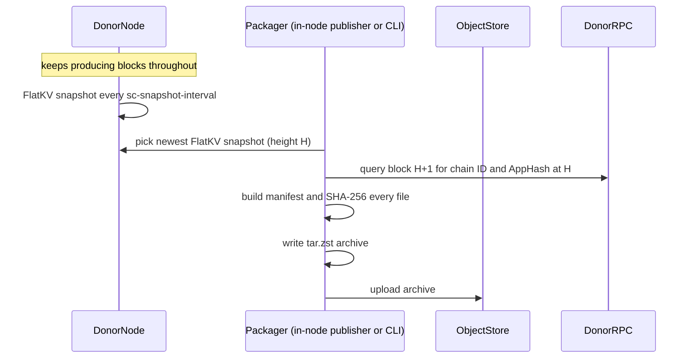

# FlatKV-Only State Sync via Checkpoint Archives

## Summary

A FlatKV-only state sync path based on out-of-band checkpoint distribution.
A running node periodically publishes its immutable FlatKV checkpoint as an
archive to object storage, without leaving consensus. A bootstrapping node
installs that archive, verifies it (light client + full content re-hash),
derives its query store from it locally, and block-syncs from the archived
height. It replaces the current restore pipeline:

```text
download snapshot chunks -> protobuf decode -> per-key FlatKV import -> Pebble LSM rebuild -> LtHash recomputation
```

with:

```text
download archive -> verify manifest -> install checkpoint files -> light-client verify AppHash -> LtHash re-scan content -> rebuild state_store -> block sync
```

Measured at production scale (39 GiB checkpoint, ~1.0B rows): create drops
from hours to ~4 minutes, a fully verified restore takes ~34 minutes for an
RPC node and ~16 minutes for a validator, and both scale with provisioned
disk throughput instead of per-key import cost.

## The Design in Three Decisions

Everything else in this document is a consequence of three decisions.

**1. Move the checkpoint, not the keys.** Once all modules live in FlatKV,
a FlatKV local snapshot — a Pebble hardlink checkpoint of immutable SSTs,
manifests, and metadata — *is* the complete consensus commit-store state at
one version. The archive packs those files as-is, and restore installs them
as-is. The receiver never rebuilds an LSM from a key stream, which is where
the old path burns its time (per-key decode, write amplification,
commitment recomputation). This only holds in FlatKV-only mode; both create
and restore refuse to run otherwise, because a partially migrated store
would also need memIAVL state and migration routing metadata that are
outside this archive's safety model.

**2. Single source of truth.** The archive carries exactly one payload: the
FlatKV checkpoint. The query layer (`state_store`) is *derived* data — at
any height H its logical content is exactly the key/value set committed in
FlatKV at H — so restore regenerates it locally by iterating the installed
checkpoint instead of shipping the donor's copy. The archive therefore
cannot carry a consensus/query-store inconsistency by construction, and the
query layer inherits whatever verification the checkpoint passed. (CosmWasm
is fully deprecated before FlatKV-only rollout, so there is no `wasm`
payload either.)

**3. Out-of-band distribution, explicit trust chain.** Archives travel
through untrusted object storage, outside the Tendermint state sync
protocol. Trust is reconstructed on the receiver as a chain of four checks —
bidirectional manifest hashes, light-client AppHash verification, a full
LtHash re-scan of the installed content, and the first-start ABCI
handshake — that together bind every installed byte to a
consensus-verified AppHash (see Trust Model). The content re-scan is the
step that replaces the old path's implicit verification: recomputing the
LtHash during import was never incidental cost, it was the binding of
content to consensus, and the archive path pays for it explicitly rather
than silently trading it away for speed.

## Goals

- Automatic, online archive production: any healthy FlatKV-only node with an
  upload target can publish, while validating, signing, and committing
  blocks. No operator action, no downtime.
- Single source of truth: the archive contains only the FlatKV checkpoint;
  everything else a node needs is derived from it locally.
- Preserve the existing state sync trust model, including its content-level
  guarantee (see Trust Model).
- Serve both node shapes from one archive: validators (no query store) and
  RPC nodes (query store rebuilt at the archive height).
- Keep the first implementation operationally simple and out-of-band from
  the existing Tendermint state sync protocol.

## Non-Goals

- Not a replacement for block sync: after restore, the node block-syncs
  everything above the archived height.
- Does not make memIAVL or partially migrated stores file-copy safe; the
  design is intentionally gated on FlatKV-only mode.
- Does not require S3 specifically; S3 is the validation backend, the format
  is object-store agnostic.
- Does not yet define archive discovery or retention policy.

## Background

Current state sync serializes application state as protobuf `SnapshotItem`
records and restores by importing each key/value pair into the target store.
Benchmarks show creation improving with FlatKV migration (6h31m memIAVL-only
to 2h06m EVM-migrated on 10k IOPS / 750 MiB/s hardware) but restore staying
effectively flat (37m53s vs 34m24s; 1h19m vs 55m46s on constrained
hardware). The signal: restore stays expensive even when state gets smaller,
because the cost is not the bytes — it is rebuilding Pebble state key by key
and recomputing commitment metadata. The old path is CPU- and
compaction-bound; provisioned disk throughput does not convert into
wall-clock speed. Decision 1 above is what changes that.

## Archive Format

A zstd-compressed tar stream: `manifest.json` first, then the checkpoint.

```text
manifest.json
flatkv/snapshot-<height>/
  account/
  code/
  storage/
  misc/
  metadata/
```

The manifest records the archive format version, chain ID, archived height,
archived AppHash, creation timestamp, snapshot name (plus the state-store
checkpoint name in the legacy copy shape), and — for every file — its
archive path, size, mode, and SHA-256.

Not archived: Tendermint databases, blockstore, tx indexes, config, private
keys. Restore creates the minimal Tendermint state needed to resume from the
archived height; node identity stays local to the target.

(`create` retains `--include-state-store` and `--include-wasm` for the
legacy copy shape — see Legacy Copy Shape below. Neither is part of the
primary design.)

## Producer: Create

The primary surface is an automatic, interval-driven pipeline inside the
running node: every configured block interval the node takes an immutable
FlatKV snapshot (existing `sc-snapshot-interval` behavior — a Pebble
hardlink checkpoint completing in milliseconds without blocking the commit
path), then packages and uploads it. Packaging reads only the immutable
snapshot directory, so nothing races the live database and the donor needs
no quiescing or maintenance window.



The donor RPC query anchors the archive to a chain ID, height, and AppHash;
the AppHash for height H is committed in the header of block H+1, so the
packager fetches the next block.

The same packaging logic is exposed as an operator command for ad-hoc
production:

```bash
seid flatkv-archive create \
  --home <donor-home> \
  --chain-id <chain-id> \
  --archive-rpc <donor-rpc> \
  --out <local-archive.tar.zst> \
  --upload s3://<bucket>/<key>
```

Status: snapshotting, packaging, and upload are implemented and validated;
the in-node scheduler that triggers packaging automatically after each
interval is the remaining increment (rollout step 4). In the validation
runs, packaging was invoked through the CLI against the node's automatically
produced snapshots.

## Consumer: Restore

```mermaid
sequenceDiagram
    participant Operator
    participant TargetNode
    participant ArchiveCLI
    participant ObjectStore
    participant TrustedRPC
    participant BlockPeers

    Operator->>ArchiveCLI: seid flatkv-archive restore
    ArchiveCLI->>ObjectStore: download archive
    ArchiveCLI->>ArchiveCLI: extract; verify SHA-256 both directions
    ArchiveCLI->>TargetNode: install FlatKV checkpoint
    ArchiveCLI->>TrustedRPC: verify archived AppHash via light client
    ArchiveCLI->>TargetNode: bootstrap Tendermint state at archived height
    ArchiveCLI->>TargetNode: full LtHash re-scan of installed content
    ArchiveCLI->>TargetNode: rebuild state_store at H from the checkpoint
    TargetNode->>BlockPeers: start normally and block-sync remaining blocks
```

```bash
seid flatkv-archive restore \
  --home <target-home> \
  --chain-id <chain-id> \
  --from s3://<bucket>/<key> \
  --verification-rpc <rpc-a> \
  --verification-rpc <rpc-b> \
  --trust-height <trusted-height> \
  --trust-hash <trusted-hash> \
  --force
```

The steps, in order, with why the order matters:

1. **Extract and verify the manifest, both directions.** Every manifest
   entry must be present with a matching SHA-256, and every archive entry
   must be listed in the manifest — an unlisted file would otherwise be
   installed (installation renames whole directories) with no hash covering
   it.
2. **Install the checkpoint** under the target FlatKV root and atomically
   activate the `current` symlink. `--force` replaces existing
   archive-managed directories.
3. **Light-client verification** using at least two RPC endpoints plus a
   trusted height/hash. If the verified header's AppHash does not match the
   manifest, restore fails — in seconds, before any expensive work.
4. **Bootstrap Tendermint state**: state, block metadata, and finalize-block
   response sufficient to start from the archived height.
5. **Content verification**: re-scan every installed physical row against
   the checkpoint's LtHash commitment (Trust Model check 3;
   `--skip-content-verification` opts out with a loud warning). Runs before
   the rebuild so poisoned content fails before the rebuild cost is paid.
6. **Rebuild `state_store` at H** by iterating every committed physical row
   of the now-verified checkpoint through the same FlatKV-node conversion
   path the state sync SS importer uses (`convertFlatKVNodes`):
   module-prefixed rows route back to their Cosmos store keys, merged EVM
   account rows split into nonce and code-hash entries, storage/code rows
   deserialize to their logical values. The stream imports into a fresh SS
   at version H and stamps the earliest/latest watermarks exactly as the
   state sync restore path does. Parallelism follows
   `state-store.ss-import-num-workers`. Skipped when the node runs without
   SS (validators), when the archive carries a legacy SS payload, or with
   `--rebuild-state-store=false`.

The rebuilt SS has exactly one version, H. History accumulates from H
forward as the node block-syncs; height-parameterized queries below H return
nothing on a freshly restored node. Operators of deep-history RPC/archive
nodes must restore from an old enough archive and replay forward, or use the
legacy copy shape.

Target requirements (operational conventions, not enforced by code):

- The target must be **offline** during restore. The CLI does not check for
  a running `seid` before replacing directories under `--force`; restoring
  against a live target corrupts it.
- The target's Tendermint databases must be **clean**. Restore bootstraps
  Tendermint state but does not wipe an existing blockstore; bootstrapping
  onto a home whose blockstore already holds blocks (any height) fails with
  a non-contiguous-blocks panic. Remove the Tendermint block/state databases
  when reusing a home; a fresh home has no such issue.

The chain itself stays live throughout: peers keep producing blocks while an
archive is created, uploaded, downloaded, restored, and caught up to.

## Trust Model

The object store is not trusted. It can be unavailable, stale, or malicious.
The design's obligation is a complete chain from the installed bytes to a
consensus-verified AppHash, built from four checks. Each check binds one
specific link, and it matters to be precise about which:

1. **Manifest SHA-256 (bidirectional).** Every manifest entry must match its
   extracted file, and every archive entry must be listed in the manifest.
   This detects transport/extraction corruption and rejects smuggled files.
   It is *not* a consensus proof: the hashes are producer-computed, so a
   malicious producer can ship a self-consistent manifest for bad state.
2. **Light-client verification.** The manifest's claimed AppHash is verified
   against a trusted header and validator-set path — the same trust anchor as
   in-protocol state sync. This authenticates the archive's *metadata*
   (height, AppHash). By itself it never reads the installed files.
3. **Full LtHash re-scan (restore-time content check).** Restore re-hashes
   every installed physical row and requires the result to equal the
   checkpoint's persisted LtHash commitment (including the per-DB and
   per-module decomposition). This is the link the first two checks cannot
   provide: without it, a producer could pack poisoned rows next to a
   genuine, copied LtHash metadata file and pass checks 1 and 2, because the
   persisted commitment is trusted rather than recomputed. The in-protocol
   restore path gets this binding for free by recomputing the LtHash while
   importing each key; the archive path must — and does — pay for it
   explicitly. `--skip-content-verification` disables this check and is only
   appropriate when the producer is trusted end to end (e.g. restoring your
   own node's archive); the CLI warns loudly.
4. **First-start ABCI handshake.** The application derives its reported hash
   from the same persisted LtHash metadata that check 3 just validated, and
   Tendermint compares it against the light-client-bootstrapped
   `state.AppHash`. This closes the final link — commitment metadata to
   consensus — so a producer that forges the metadata to match poisoned
   content (defeating check 3's reference) produces a different AppHash and
   is refused at startup, before the node serves anything.

Together: bytes on disk ↔ (3) ↔ LtHash commitment ↔ (4) ↔ verified AppHash ↔
(2) ↔ trusted headers. Every byte a node trusts traces back to consensus.

Decision 2 extends this to the query layer: because `state_store` is rebuilt
locally from the content-verified checkpoint rather than shipped alongside
it, the query layer inherits the checkpoint's verification. A legacy archive
that carries an SS payload cannot make that claim — its SS bytes are only
integrity-checked (SHA-256), not consensus-verified.

## Legacy Copy Shape

`--include-state-store` predates the rebuild design and remains available
for operators who want to transplant a donor's full SS history instead of
rebuilding at H. Because `state_store` is a live Pebble database (packing it
directly races WAL rotation — the failure that forced the first prototype's
donor-quiesce rule), the donor must enable online state-store checkpoints:
every `state-store.ss-checkpoint-interval` blocks, a Pebble hardlink
checkpoint of each backend lands under `data/state_store/snapshots/`,
completing in milliseconds and never blocking the commit path (retention:
`ss-checkpoint-keep-recent`).

The checkpoint label carries a completeness guarantee: the manager reads the
applied version V, drains the async apply queues (a barrier), then
checkpoints — so every version <= V is inside. Content past V may be
mid-flight, which is safe because restore block-syncs from the FlatKV height
H forward anyway. Hence the pairing rule `create` enforces: newest SS
checkpoint (label V), then newest FlatKV snapshot with H <= V. The restored
query store has no holes below H, and replay from H+1 fills everything above.

`--include-wasm` similarly packs the wasm directory for chains that still
run CosmWasm. Neither flag is part of the primary design; the SC-only
default needs no SS checkpointing on the donor at all.

## Validation

Production-scale validation used a forked chain, not pacific-1 itself: real
pacific-1 memIAVL state converted to FlatKV-only, validator identities
rewritten to a local four-validator set, Tendermint state forged, isolated
chain ID `pacific-fork-1`. This gives production-shaped application state
without pacific-1 keys or consensus.

Dataset:

- Source: real pacific-1 state around height 219,060,000; fork start
  ~219,060,002.
- Raw archive-managed state: FlatKV checkpoint 39 GiB, `state_store` 38 GiB,
  `wasm` 12 GiB (~89 GiB total).
- Full (legacy-shape) archive: 81.4 GiB tar.zst — 23,847 files
  quiesced-donor (height 219,130,000), 23,425 files live-donor (height
  219,950,000). SC-only archive: 37.6 GiB, ~10,113 files.
- The four-node fork produced blocks stably across the validation window
  (~219,060,002 to beyond 220,490,000), all validators `catching_up=false`.

Hardware for restore runs: `m6a.4xlarge` (16 vCPU / 64 GiB), eu-central-1a,
pod request 8 CPU / 32 GiB, 300 GiB volume.

### Timing

| Scenario | Storage | Result |
| --- | --- | --- |
| Full-archive create + upload (quiesced donor) | donor on default gp3 | 18m38s |
| Full-archive create + upload (live donor, online SS checkpoint) | donor on default gp3 | 19m35s |
| Full-archive restore + bootstrap (pre-content-check) | default gp3, 3000 IOPS / 125 MiB/s | 32m35s |
| Full-archive restore + bootstrap (pre-content-check) | gp3, 10k IOPS / 1000 MiB/s | 12m02s (live-donor archive: 12m47s) |
| SC-only create + upload (live donor) | donor on default gp3 | 4m08s / 4m13s / 4m07s across three runs |
| — pack / upload split | same | 2m07s / 2m15s |
| SC-only restore + bootstrap (no rebuild, SS-disabled shape, pre-content-check) | gp3, 10k IOPS / 1000 MiB/s | 4m10s |
| SC-only restore + rebuild (pre-content-check) | gp3, 10k IOPS / 1000 MiB/s | 20m59s |
| SC-only **verified** restore + rebuild (height 220,290,000) | gp3, 10k IOPS / 1000 MiB/s | **34m04s** |
| — download + extract + install + light-client bootstrap | same | 3m46s |
| — content verification (full LtHash re-scan, 39 GiB / 1.0B rows) | same | 12m36s |
| — `state_store` rebuild (1,003,795,371 entries, 8 workers) | same | 17m37s |
| SC-only **verified** restore, full-flow rerun next day (height 220,490,000) | gp3, 10k IOPS / 1000 MiB/s | 35m30s (bootstrap 3m41s, verify 13m42s, rebuild 18m04s) |
| Light-client verify + Tendermint bootstrap | included above | ~10-12s |

Reading the table honestly:

- **The verified rows are the like-for-like comparison with the old path.**
  The old path's restore *includes* content verification (LtHash recomputed
  per imported key); the pre-content-check rows did not, so part of their
  raw speedup came from silently dropping verification work. With the
  re-scan on by default: RPC shape 34m04s vs the old path's 34m24s-37m53s on
  comparable hardware — parity, not a win, for equivalent verification and
  rebuild work. Validator shape ~16m22s (3m46s + 12m36s) — still roughly 2x,
  because nothing needs rebuilding.
- **The structural wins are unaffected**: create drops from 2.1-6.3 hours to
  ~4 minutes, and restore converts provisioned disk throughput into
  wall-clock speed (32m35s to 12m02s pre-check by changing only the EBS
  class), which the old path cannot.
- **The numbers reproduce.** The full verified flow was re-run end to end
  the next day against a fresh archive; every phase landed within minutes of
  the first run, and the rebuild reproduced within seconds across three runs
  at different heights.
- SC-only create is faster than its byte share predicts because
  `state_store` and `wasm` contribute most of the file count, and per-file
  overhead is significant. Pack and upload are near-equal; streaming the tar
  into the upload (rollout step 5) would collapse create to roughly the
  longer of the two.

| Operation | Existing key-stream state sync | Archive path |
| --- | --- | --- |
| Snapshot/create | 2.1-2.5h EVM-migrated FlatKV; 6.3h memIAVL-only | ~4m SC-only live donor, including upload |
| Restore/import | 34m24s-37m53s (10k / 750 MiB/s); 55m46s-1h19m constrained | verified: 34m04s RPC shape / ~16m22s validator shape (10k / 1000 MiB/s) |
| Content verification | inherent: LtHash recomputed per imported key | explicit: one sequential re-scan of the installed checkpoint |
| RPC query state | not transferred | rebuilt locally at H from the verified checkpoint |
| Bottleneck | per-key decode/import, LSM rebuild, LtHash recomputation | object-store and disk throughput, plus one verification scan |

The key result is not that the archive path is faster in these runs; it is
that it changes what must be optimized. Restore becomes a file IO pipeline
rather than a state reconstruction pipeline.

### End-to-end checks beyond timing

- The restored node starts, passes the first-start AppHash handshake (Trust
  Model check 4), block-syncs to the live head, and reports
  `catching_up=false`.
- On the fully verified rerun, a height-parameterized query at the archive
  height (`bank total --height H`) returned byte-identical results on the
  rebuilt node and a donor cluster node — the query layer's inheritance of
  the checkpoint's verification, demonstrated under the complete trust
  chain.
- The donor kept signing and committing throughout every create (e.g. ~2,500
  blocks during the 19m35s full-archive run) with no consensus interruption
  and no file-hash mismatches.
- The production-scale rebuild surfaced a real conversion bug that
  small-fixture tests cannot hit: `convertFlatKVNodes` applied EVM key-kind
  parsing to every module, so a legacy module key that coincidentally
  matched an EVM prefix byte and length was deserialized as the wrong value
  type. The fix gates EVM parsing on the `evm` module, mirroring the write
  side (`classifyAndPrefix`) and read routing (`routePhysicalKey`); the path
  is shared with FlatKV-only state sync, so the fix hardens both. Upstreamed
  as [PR #3817](https://github.com/sei-protocol/sei-chain/pull/3817),
  together with guards rejecting degenerate physical keys (empty module or
  inner key) that the SS importer would otherwise silently drop.

## Known Limitations

- **No history below H.** The rebuilt query store has exactly one version;
  see Consumer: Restore.
- **Restore staging.** The downloaded archive is staged before extraction
  (one restore currently moves roughly `archive write + archive read +
  extracted state write`; the first large run was evicted for staging in
  container ephemeral storage — set `TMPDIR` to the data volume). Follow-up:
  stream extraction directly from object storage, verifying during
  extraction.
- **Create staging.** The archive is written to local disk before upload,
  which dominated create on the default-gp3 donor. Follow-up: stream
  packing directly into the uploader (overlaps the 2m07s/2m15s halves).
- **Discovery and lifecycle undefined.** The prototype takes an explicit
  object URI. Production needs publish cadence, retention, naming, a
  metadata index, minimum trust-height policy, and cleanup for failed
  restores.

## Alternatives Considered

**Extend the existing state sync snapshot stream.** Keep Tendermint's
in-protocol mechanism and add FlatKV-specific snapshot item encodings. This
preserves one protocol path but keeps the key-stream restore model, and with
it the receiver's dominant costs: per-key decode/import, Pebble write
amplification, commitment reconstruction.

**Out-of-band checkpoint archive (chosen).** Simpler to validate, keeps the
trust boundary explicit, and exploits the FlatKV-only invariant directly:
the checkpoint directory already is the final database shape. The cost is
operational plumbing around publication, retention, and restore commands.

## Open Questions

- Which nodes publish in production: every full node, a designated subset,
  or dedicated archive producers? Any healthy FlatKV-only node can; the
  question is operational (upload cost, write contention, redundancy).
- Publication cadence relative to the snapshot interval — every snapshot, or
  every Nth?
- Should producers sign manifests as an operational convenience, even though
  authenticity comes from light-client verification?
- Should restore integrate into node startup, or remain a separate operator
  command?

## Rollout Plan

1. Packaging/restore CLI behind a FlatKV-only guard. (done)
2. Live-safe `state_store` checkpointing. (done: `ss-checkpoint-interval`;
   now only needed by the legacy copy shape)
3. FlatKV checkpoint as single source of truth: SC-only archives by default,
   restore-side rebuild, restore-time content verification. (done)
4. In-node publisher: package and upload automatically after each snapshot
   interval, driven by node configuration (upload target, cadence, remote
   retention). Completes the primary design surface.
5. Streaming upload/download instead of local staging.
6. Operator runbook for publication and restore.
7. Repeated restore benchmarks on the target production instance and storage
   classes.
8. Decide whether restore integrates into node startup.

## Reproduction Commands From Validation

Create from a live donor (keeps producing blocks; SC-only by default):

```bash
seid flatkv-archive create \
  --home /home/nonroot/.sei \
  --chain-id pacific-fork-1 \
  --archive-rpc http://fork-0.fork:26657 \
  --out /home/nonroot/.sei/prod-archive.tar.zst \
  --upload s3://harbor-validation-results/eng-yiren/flatkv-archive-prod/pacific-fork-1.tar.zst
```

Restore into a fresh target home (verifies content and rebuilds
`state_store` at the archive height by default):

```bash
TMPDIR=/home/nonroot/.sei/tmp \
seid flatkv-archive restore \
  --home /home/nonroot/.sei \
  --chain-id pacific-fork-1 \
  --from s3://harbor-validation-results/eng-yiren/flatkv-archive-prod/pacific-fork-1.tar.zst \
  --verification-rpc fork-0.fork:26657 \
  --verification-rpc fork-1.fork:26657 \
  --trust-height <trusted-height> \
  --trust-hash <trusted-hash> \
  --force
```

Legacy copy shape (transplants the donor's full SS history instead of
rebuilding at H): enable `ss-checkpoint-interval` on the donor and pass
`--include-state-store` to `create`.
