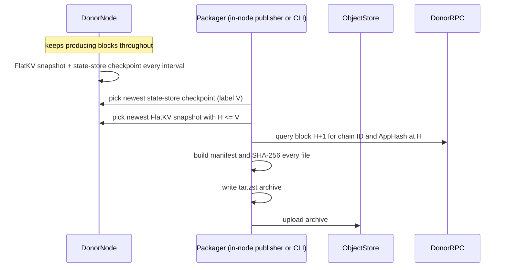
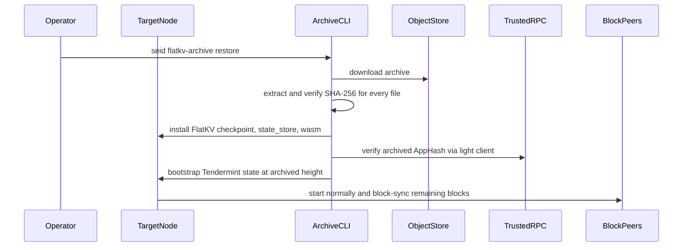

# FlatKV-Only State Sync via Checkpoint Archives

## Summary

This document proposes a FlatKV-only state sync path based on out-of-band
checkpoint distribution. A running node automatically takes immutable
checkpoints of its state at a configured block interval and publishes them as
archives to object storage, without leaving consensus. A bootstrapping node
restores such an archive, verifies it against Tendermint light client trust,
and then resumes normal block sync from the archived height — instead of
replaying a logical key/value stream into a fresh database.

The design relies on a FlatKV-only invariant: once all modules have migrated to
FlatKV, the FlatKV checkpoint is the complete consensus commit-store state for
one application version. That lets state sync move the already-built Pebble
database shape instead of reconstructing it on the receiver.

At a high level, the design replaces the current restore path:

```text
download snapshot chunks -> protobuf decode -> per-key FlatKV import -> Pebble LSM rebuild -> LtHash recomputation
```

with:

```text
download archive -> verify file hashes -> install Pebble checkpoint files -> verify AppHash with light client -> block sync
```

The rest of this document covers the archive format, create and restore flows,
trust model, validation methodology, measured performance, and rollout risks.

## Goals

- Archive production is automatic and online: a running node snapshots its
  state every configured interval and publishes the archive, while continuing
  to produce blocks. No operator action and no downtime on the producer.
- Provide a fast bootstrap path for nodes after the chain is fully migrated to
  FlatKV.
- Avoid per-key state reconstruction during restore.
- Preserve the existing state sync trust model: object storage is an untrusted
  transport, while the restored application hash is verified against trusted
  Tendermint headers.
- Support RPC-capable nodes, not only validators, by restoring the query state
  required for latest and historical RPC queries.
- Keep the first implementation operationally simple and out-of-band from the
  existing Tendermint state sync protocol.

## Non-Goals

- This is not a replacement for block sync. After restore, the node still
  block-syncs any blocks produced after the archived height.
- This does not make memIAVL or partially migrated stores file-copy safe. The
  design is intentionally gated on FlatKV-only mode.
- This does not require S3 specifically. S3 is the validation backend; the
  archive format is object-store agnostic.
- This does not initially define an archive discovery or retention policy.

## Background

Current state sync serializes the application state as protobuf
`SnapshotItem` records and restores it by importing each key/value pair into
the target store. In the memIAVL path, export walks IAVL snapshot nodes. In the
FlatKV path, the composite store streams FlatKV physical keys through the same
logical chunking protocol.

Measured behavior from the existing benchmark artifacts:

- On 256 GiB / 10k IOPS / 750 MiB/s hardware, state-sync snapshot creation
  improved from 6h31m on memIAVL-only to 2h06m on EVM-migrated FlatKV.
- On the same hardware, state-sync restore was effectively flat: 37m53s for
  memIAVL-only vs 34m24s for EVM-migrated.
- On constrained 128 GiB / default gp3 hardware, restore was 1h19m for
  memIAVL-only vs 55m46s for EVM-migrated.

The important signal is that restore remains expensive even when the state is
smaller. The migrated node restores fewer bytes, but each FlatKV byte is more
expensive to reconstruct because the restore path rebuilds Pebble state from a
key stream and recomputes commitment metadata. The old path is therefore
CPU- and compaction-heavy; provisioned disk throughput is not converted
directly into wall-clock speed.

FlatKV-only changes the available primitive. A FlatKV local snapshot is a
Pebble checkpoint: immutable SST files, manifests, and metadata directories
that represent the committed store at one version. Once all modules live in
FlatKV, that checkpoint is the complete consensus commit-store state. Copying
the checkpoint files preserves the final database shape instead of rebuilding
it key by key.

## Design Overview

The primary design surface is an automatic, interval-driven pipeline inside
the running node. Every configured block interval, the node:

1. takes an immutable FlatKV snapshot (existing `sc-snapshot-interval`
   behavior — a Pebble hardlink checkpoint of the commit store);
2. takes an online state-store checkpoint (`ss-checkpoint-interval`, described
   below) — also a hardlink checkpoint, so neither step blocks the commit
   path;
3. packages the paired snapshot + checkpoint + `wasm` into a manifest-carrying
   archive and uploads it to the configured object-store target.

All three steps run while the node keeps validating, signing, and committing
blocks. Snapshot creation is hardlink-based and completes in milliseconds;
packaging and upload read only immutable directories, so they cannot race the
live database. The producer needs no operator intervention and no maintenance
window: enabling the intervals and an upload target makes any healthy
FlatKV-only node an archive publisher.

Steps 1-2 and the packaging/upload stage are implemented and validated today.
The in-node scheduler that triggers step 3 automatically after each interval
is the remaining increment; in the validation runs, step 3 was invoked through
the auxiliary CLI against the node's automatically produced checkpoints.

### Auxiliary CLI Surface

The same packaging/upload logic and the restore path are exposed as operator
commands. `create` exists for ad-hoc archive production (for example,
publishing outside the regular cadence, or from a stopped node); `restore` is
how a bootstrapping node consumes an archive:

```bash
seid flatkv-archive create \
  --home <donor-home> \
  --chain-id <chain-id> \
  --archive-rpc <donor-rpc> \
  --out <local-archive.tar.zst> \
  --upload s3://<bucket>/<key>

seid flatkv-archive restore \
  --home <target-home> \
  --chain-id <chain-id> \
  --from s3://<bucket>/<key> \
  --verification-rpc <rpc-a> \
  --verification-rpc <rpc-b> \
  --trust-height <trusted-height> \
  --trust-hash <trusted-hash> \
  --force
```

Both the automatic pipeline and the CLI must refuse to run unless the app
configuration is FlatKV-only. That guard matters because the archive only
contains FlatKV commit-store state. A partially migrated store would still
require memIAVL state and migration routing metadata that are outside this
archive's safety model.

### Archive Format

The archive is a zstd-compressed tar stream. It starts with `manifest.json`,
followed by state files.

```text
manifest.json
flatkv/snapshot-<height>/
  account/
  code/
  storage/
  misc/
  metadata/
state_store/
  ...
wasm/
  ...
```

The archive includes:

- `flatkv/snapshot-<height>/`: an immutable FlatKV checkpoint from the donor.
  This is the consensus-critical state.
- `state_store/`: query-state Pebble data needed by RPC nodes, sourced from an
  online state-store checkpoint (see below). WAL `changelog/` directories are
  excluded from the archive.
- `wasm/`: CosmWasm code blobs, if the directory exists.
- `manifest.json`: archive metadata and one file entry per archived file.

The manifest records:

- archive format version
- chain ID
- archived height
- archived application hash
- creation timestamp
- FlatKV snapshot name
- state-store checkpoint name (empty when packed from the live directory)
- for each file: archive path, size, mode, and SHA-256

Tendermint databases, blockstore databases, tx indexes, config, and private
keys are not archived. Restore creates the minimal Tendermint state needed to
resume from the archived height, and node identity remains local to the target
node.

### Online State-Store Checkpoints

The FlatKV checkpoint is immutable by construction, but `state_store` is a
live Pebble database. Packing it directly races WAL rotation and compaction,
which is why the first prototype required a quiesced donor. The donor node now
solves this itself: every `state-store.ss-checkpoint-interval` blocks, the
state store takes a Pebble hardlink checkpoint of each backend into

```text
data/state_store/snapshots/
  current -> snapshot-<version>
  snapshot-<version>/
    cosmos/<backend>/
    evm/<backend>/          (only when evm-ss-split is enabled)
```

Checkpoints are hardlink trees plus a flushed WAL, so they complete in
milliseconds regardless of database size and never block the commit path.
Retention is `ss-checkpoint-keep-recent` older checkpoints besides the newest.

The checkpoint label carries a completeness guarantee. The manager reads the
applied version `V` first, then drains the async apply queues (a barrier), and
only then checkpoints. Because the commit pipeline enqueues changesets in
block order, every version `<= V` is inside the checkpoint. Content past `V`
may be mid-flight, which is safe: restore always block-syncs from the FlatKV
height `H` forward, so everything above `H` is rewritten anyway.

That yields the pairing rule `flatkv-archive create` enforces: pick the newest
state-store checkpoint (label `V`), then the newest FlatKV snapshot with
`H <= V`. The restored query store then has no holes below the archive height,
and block replay from `H+1` fills everything above it.

### Create Flow

The packaging stage is the same whether it is triggered by the in-node
publisher after an interval boundary or invoked manually through the CLI:



The donor RPC query anchors the archive to a chain ID, height, and AppHash.
The CLI should fetch the block after the snapshot height when necessary, since
the AppHash for height `H` is committed in the next block header.

Both archive sources are immutable directories, so hashing and packing cannot
race the running node. When no online checkpoint exists (checkpointing
disabled), create falls back to packing the live `state_store` directory and
prints a warning; that fallback is only safe on a stopped donor.

### Restore Flow



Restore must install the checkpoint under the target FlatKV root and atomically
activate the `current` symlink. It must install `state_store` and `wasm` only
after file verification succeeds. With `--force`, restore replaces existing
archive-managed state directories.

After installing files, restore performs light-client verification using at
least two RPC endpoints plus a trusted height/hash. If the verified header's
AppHash does not match the archive manifest, restore fails. If verification
succeeds, restore bootstraps Tendermint state, block metadata, and finalize
block response data sufficient for the node to start from the archived height.

### Online Chain Compatibility

The archive path is intended to work while the chain continues producing
blocks. It does not require stopping the network or taking a global maintenance
window.

There are three separate online/offline concerns:

- The **chain** remains live. Peers continue producing blocks while an archive
  is created, uploaded, downloaded, restored, and later block-synced by the
  target node. The restored node starts from the archived height and catches up
  to the live head through normal block sync.
- The **target node** must be offline during restore. Restore replaces
  archive-managed local state directories (`flatkv`, `state_store`, and `wasm`)
  and bootstraps Tendermint state. The target process should start only after
  restore and light-client verification succeed.
- The **archive donor** keeps producing blocks during archive creation. With
  `ss-checkpoint-interval` enabled, both archive sources — the FlatKV snapshot
  and the state-store checkpoint — are immutable directories on the donor, so
  `create` can hash and pack them while the donor validates, signs, and
  commits new blocks. No quiescing or maintenance window is needed.

In validation, the four-validator forked cluster stayed live, and the donor
validator itself kept signing and committing blocks while `create` hashed,
packed, and uploaded the full archive from its online checkpoints. The
restored victim node then block-synced to the live head.

## Trust Model

The object store is not trusted. It can be unavailable, stale, or malicious.
The archive has two layers of protection:

1. The manifest's per-file SHA-256 entries detect corruption inside the archive
   extraction and installation process.
2. Tendermint light-client verification authenticates the archived AppHash
   against a trusted header and validator set path, which is the same trust
   anchor model as existing state sync.

The SHA-256 manifest alone is not a consensus proof. A malicious archive
producer can produce a self-consistent manifest for bad state. The restored
state is trusted only after the FlatKV checkpoint's AppHash is verified against
the trusted chain.

## Operational Validation

The production-scale validation used a forked chain, not pacific-1 itself. The
test converted real pacific-1 memIAVL state into FlatKV-only state, rewrote the
validator identities into a local four-validator set, forged Tendermint state
for the fork, and ran an isolated chain ID `pacific-fork-1`.

This gave the test production-shaped application state without requiring
pacific-1 validator private keys or joining pacific-1 consensus.

### Dataset

- Source: real pacific-1 state around height 219,060,000.
- Fork start: approximately height 219,060,002; the first live fork block was
  219,060,003.
- Raw archive-managed state:
  - FlatKV checkpoint: 39 GiB
  - `state_store`: 38 GiB
  - `wasm`: 12 GiB
  - total: approximately 89 GiB
- Archive: 81.4 GiB tar.zst, 23,847 files. Pebble SST files are already
  compressed, so zstd gains little.

The four-node forked cluster continued producing blocks stably. During the
validation window, it advanced from roughly 219,060,002 to beyond 219,344,000,
and all validators reported `catching_up=false`.

### Timing Results

| Scenario | Storage | Result |
| --- | --- | --- |
| Archive create + S3 upload (quiesced donor) | donor on default gp3 | 18m38s |
| Archive create + S3 upload (live donor, online SS checkpoint) | donor on default gp3 | 19m35s |
| Restore + bootstrap, round 1 | default gp3, 3000 IOPS / 125 MiB/s | 32m35s |
| Restore + bootstrap, round 2 | gp3, 10k IOPS / 1000 MiB/s | 12m02s |
| Restore + bootstrap (live-donor archive) | gp3, 10k IOPS / 1000 MiB/s | 12m47s |
| SC-only create + upload (live donor, no `state_store`/`wasm`) | donor on default gp3 | 4m08s |
| SC-only restore + bootstrap | gp3, 10k IOPS / 1000 MiB/s | 4m10s |
| Light-client verify + Tendermint bootstrap | included above | ~10-12s |

The SC-only run packs just the FlatKV checkpoint (37.6 GiB archive, 10,113
files vs 81.4 GiB / 23,425 files for the full archive) — the shape a
validator-focused archive would take. It is faster than its byte share
predicts because `state_store` and `wasm` contribute most of the archive's
file count, and per-file overhead (hashing setup, tar headers) is significant.
The restored node block-synced ~9,700 blocks and reached the chain head about
2.5 minutes after starting; a node restored this way serves consensus and
latest-state queries but has no historical query layer.

The live-donor run is the end-to-end validation of the online state-store
checkpoint design:

- `create` selected state-store checkpoint version 219,953,060 and paired it
  with FlatKV snapshot 219,950,000; the archive labels height 219,950,000.
- The donor produced blocks throughout the 19m35s create, advancing roughly
  2,500 blocks with no consensus interruption and no file-hash mismatches.
- The restored node bootstrapped at 219,950,000, block-synced the ~6,000-block
  gap to the live chain head, and reported `catching_up=false` within about
  four minutes of starting.

Hardware baseline for the restore comparisons:

- instance: `m6a.4xlarge`
- CPU/RAM: 16 vCPU, 64 GiB RAM
- region/zone: eu-central-1a
- pod request: 8 CPU, 32 GiB memory
- volume size: 300 GiB

The restore improvement from 32m35s to 12m02s came from changing only the EBS
volume throughput class. This confirms the design's key property: archive
restore is IO-bound and can use provisioned disk throughput. The current
implementation still stages the downloaded archive before extraction, so one
restore moves roughly:

```text
81 GiB archive write + 81 GiB archive read + 89 GiB extracted state write
```

Streaming extraction directly from object storage should remove the staging
write/read and is the next expected restore improvement.

### Comparison With Existing State Sync

Existing key-stream state sync is much slower on create and does not improve
linearly with disk throughput:

| Operation | Existing key-stream state sync | Archive path |
| --- | --- | --- |
| Snapshot/create | 2.1-2.5h on EVM-migrated FlatKV; 6.3h on memIAVL-only | 18m38s quiesced / 19m35s live donor, including upload |
| Restore/import | 55m46s-1h19m on constrained hardware; 34m24s-37m53s on 256 GiB / 10k / 750 MiB/s hardware | 32m35s on default gp3; 12m02s on 10k / 1000 MiB/s gp3 |
| RPC query state | not transferred by the key-stream commit-store snapshot | included via `state_store/` |
| Bottleneck | per-key decode/import, LSM rebuild, LtHash recomputation | object-store and disk throughput |

The key result is not only that the archive path is faster in these runs. It is
that it changes what must be optimized: the restore path becomes a file IO
pipeline rather than a state reconstruction pipeline.

## Known Limitations

### Live donor consistency (resolved)

The first live-donor archive attempts failed file hash verification because
`state_store` was packed from the live Pebble directory: WAL segments rotated
between manifest hashing and tar writing. This forced the initial quiesce rule
for donors.

Resolved by online state-store checkpoints (`ss-checkpoint-interval`): create
now packs an immutable checkpoint and the donor keeps producing blocks. The
live-directory path remains only as an explicit fallback for stopped donors.

Residual constraint: `create` refuses to pair a FlatKV snapshot newer than the
newest state-store checkpoint label. With matching intervals the two land
seconds apart, so in the worst case an operator waits one checkpoint interval.

### Restore staging path

The first large restore staged the 81.4 GiB downloaded archive in container
ephemeral storage and the pod was evicted under kubelet ephemeral-storage
pressure.

Current operational rule: set `TMPDIR` to a path on the data volume for large
restores.

Follow-up: stream the zstd tar directly from object storage into the target
home and verify files during extraction. This avoids the staging file entirely.

### Create staging path

The current create path writes the full tar.zst archive to local disk and then
uploads it. This adds one large write and one large read. On the measured
default gp3 donor volume, create was dominated by this local archive write.

Follow-up: stream archive creation directly into the object-store uploader.
This should overlap pack and upload and remove the local archive file from the
critical path.

### Archive discovery and lifecycle

The prototype assumes the operator passes an explicit object URI. A production
rollout should define:

- publish cadence
- retention policy
- naming convention
- metadata index
- minimum trust-height policy
- cleanup behavior for failed restores

## Alternatives Considered

### Extend the existing state sync snapshot stream

We could continue using Tendermint's in-protocol snapshot mechanism and add
FlatKV-specific snapshot item encodings. This preserves one protocol path, but
it still encourages a key-stream restore model. The receiver would keep paying
the most expensive costs: per-key decode/import, Pebble write amplification,
and commitment reconstruction.

### Out-of-band checkpoint archive

The archive design is intentionally outside the existing state sync protocol.
It is simpler to validate, keeps the trust boundary explicit, and exploits the
FlatKV-only invariant directly: the checkpoint directory is already the final
database shape. The cost is operational plumbing around archive publication,
retention, and restore commands.

## Open Questions

- Which nodes should enable automatic publication in production: every full
  node, a designated subset, or dedicated archive-producer nodes? Any healthy
  FlatKV-only node can publish by design; the question is operational (upload
  cost, object-store write contention, redundancy).
- What is the publication cadence relative to the checkpoint interval — upload
  every checkpoint, or every Nth?
- Do validators need `state_store` and `wasm` in the same archive, or should we
  publish a smaller validator archive and a larger RPC archive?
- Should the archive manifest be signed by archive producers as an operational
  convenience, even though consensus authenticity still comes from light-client
  verification?
- Should restore be integrated into node startup, or remain a separate
  operator-controlled command?

## Rollout Plan

1. Land the packaging/restore logic as an out-of-band CLI behind a FlatKV-only
   guard. (done)
2. Add live-safe `state_store` checkpointing so producers keep producing
   blocks. (done: `ss-checkpoint-interval`)
3. Add the in-node publisher: automatically package and upload after each
   checkpoint interval, driven by node configuration (upload target, cadence,
   remote retention). This completes the primary design surface.
4. Replace local archive staging with streaming upload/download.
5. Add an operator runbook for archive publication and restore.
6. Run repeated restore benchmarks on the target production instance and
   storage classes.
7. Decide whether restore should be integrated into node startup workflows or
   remain a separate operator-controlled command.

## Reproduction Commands From Validation

Enable online state-store checkpoints on the donor (`app.toml`):

```toml
[state-store]
ss-checkpoint-interval = 10000   # match state-commit.sc-snapshot-interval
ss-checkpoint-keep-recent = 1
```

Create from a live donor (keeps producing blocks):

```bash
seid flatkv-archive create \
  --home /home/nonroot/.sei \
  --chain-id pacific-fork-1 \
  --archive-rpc http://fork-0.fork:26657 \
  --out /home/nonroot/.sei/prod-archive.tar.zst \
  --upload s3://harbor-validation-results/eng-yiren/flatkv-archive-prod/pacific-fork-1.tar.zst
```

Restore into a fresh target home:

```bash
TMPDIR=/home/nonroot/.sei/tmp \
seid flatkv-archive restore \
  --home /home/nonroot/.sei \
  --chain-id pacific-fork-1 \
  --from s3://harbor-validation-results/eng-yiren/flatkv-archive-prod/pacific-fork-1.tar.zst \
  --verification-rpc fork-0.fork:26657 \
  --verification-rpc fork-1.fork:26657 \
  --trust-height <trusted-height> \
  --trust-hash <trusted-hash> \
  --force
```

