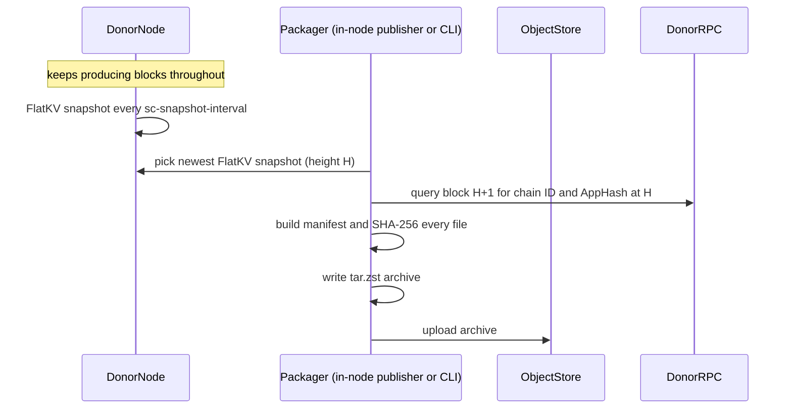

# FlatKV-Only State Sync via Checkpoint Archives

## Summary

This document proposes a FlatKV-only state sync path based on out-of-band
checkpoint distribution. A running node automatically takes immutable
checkpoints of its state at a configured block interval and publishes them as
archives to object storage, without leaving consensus. A bootstrapping node
restores such an archive, verifies it against Tendermint light client trust,
and then resumes normal block sync from the archived height — instead of
replaying a logical key/value stream into a fresh database.

The archive carries exactly one payload: the FlatKV checkpoint. It is the
single source of truth. The target node rebuilds its query layer
(`state_store`) locally by iterating the verified checkpoint, so the archive
never has to keep two databases consistent with each other, and every byte a
node trusts traces back to one light-client-verified AppHash — including the
installed content itself, which restore re-hashes in full against the
checkpoint's LtHash commitment (see Trust Model).

The design relies on a FlatKV-only invariant: once all modules have migrated to
FlatKV, the FlatKV checkpoint is the complete consensus commit-store state for
one application version. That lets state sync move the already-built Pebble
database shape instead of reconstructing it on the receiver.

At a high level, the design replaces the current restore path:

```text
download snapshot chunks -> protobuf decode -> per-key FlatKV import -> Pebble LSM rebuild -> LtHash recomputation
```

with:

```text
download archive -> verify manifest hashes -> install Pebble checkpoint files -> verify AppHash with light client -> full LtHash re-scan of installed content -> block sync
```

Note that the old path's "LtHash recomputation" is not incidental cost: it is
what binds the imported content to the verified AppHash. The archive path
keeps that binding — it performs the equivalent content verification as one
sequential re-scan of the installed checkpoint, priced separately in the
timing table — rather than silently trading it away for speed.

The rest of this document covers the archive format, create and restore flows,
trust model, validation methodology, measured performance, and rollout risks.

## Goals

- Archive production is automatic and online: a running node snapshots its
  state every configured interval and publishes the archive, while continuing
  to produce blocks. No operator action and no downtime on the producer.
- Single source of truth: the archive contains only the FlatKV checkpoint —
  the consensus commit-store state. Everything else a node needs
  (`state_store`) is derived from it locally on the target.
- Provide a fast bootstrap path for nodes after the chain is fully migrated to
  FlatKV.
- Avoid per-key state reconstruction of the consensus store during restore.
- Preserve the existing state sync trust model: object storage is an untrusted
  transport; the archived AppHash is verified against trusted Tendermint
  headers, and the installed content is bound to that AppHash through the
  FlatKV LtHash commitment (a full re-scan at restore plus the first-start
  handshake), matching the content-level guarantee the in-protocol restore
  path gets from recomputing the LtHash during import.
- Support RPC-capable nodes, not only validators, by restoring the query state
  required for latest and historical RPC queries.
- Keep the first implementation operationally simple and out-of-band from the
  existing Tendermint state sync protocol.

## Non-Goals

- This is not a replacement for block sync. After restore, the node still
  block-syncs any blocks produced after the archived height.
- This does not make memIAVL or partially migrated stores file-copy safe. The
  design is intentionally gated on FlatKV-only mode.
- This does not require S3 specifically. S3 is the validation backend; the
  archive format is object-store agnostic.
- This does not initially define an archive discovery or retention policy.

## Background

Current state sync serializes the application state as protobuf
`SnapshotItem` records and restores it by importing each key/value pair into
the target store. In the memIAVL path, export walks IAVL snapshot nodes. In the
FlatKV path, the composite store streams FlatKV physical keys through the same
logical chunking protocol.

Measured behavior from the existing benchmark artifacts:

- On 256 GiB / 10k IOPS / 750 MiB/s hardware, state-sync snapshot creation
  improved from 6h31m on memIAVL-only to 2h06m on EVM-migrated FlatKV.
- On the same hardware, state-sync restore was effectively flat: 37m53s for
  memIAVL-only vs 34m24s for EVM-migrated.
- On constrained 128 GiB / default gp3 hardware, restore was 1h19m for
  memIAVL-only vs 55m46s for EVM-migrated.

The important signal is that restore remains expensive even when the state is
smaller. The migrated node restores fewer bytes, but each FlatKV byte is more
expensive to reconstruct because the restore path rebuilds Pebble state from a
key stream and recomputes commitment metadata. The old path is therefore
CPU- and compaction-heavy; provisioned disk throughput is not converted
directly into wall-clock speed.

FlatKV-only changes the available primitive. A FlatKV local snapshot is a
Pebble checkpoint: immutable SST files, manifests, and metadata directories
that represent the committed store at one version. Once all modules live in
FlatKV, that checkpoint is the complete consensus commit-store state. Copying
the checkpoint files preserves the final database shape instead of rebuilding
it key by key.

## Design Overview

The primary design surface is an automatic, interval-driven pipeline inside
the running node. Every configured block interval, the node:

1. takes an immutable FlatKV snapshot (existing `sc-snapshot-interval`
   behavior — a Pebble hardlink checkpoint of the commit store, completing in
   milliseconds without blocking the commit path);
2. packages that snapshot into a manifest-carrying archive and uploads it to
   the configured object-store target.

Both steps run while the node keeps validating, signing, and committing
blocks. Packaging and upload read only the immutable snapshot directory, so
they cannot race the live database. The producer needs no operator
intervention and no maintenance window: any healthy FlatKV-only node with an
upload target is an archive publisher.

The restore side derives everything else. After installing and light-client
verifying the checkpoint, the target node rebuilds its `state_store` at the
archive height by iterating the checkpoint (see Restore-Side State-Store
Rebuild below). The producer's own `state_store` is never packaged, so the
archive cannot carry a consensus/query-store inconsistency by construction.

Step 1 and the packaging/upload stage are implemented and validated today.
The in-node scheduler that triggers step 2 automatically after each interval
is the remaining increment; in the validation runs, step 2 was invoked through
the auxiliary CLI against the node's automatically produced snapshots.

### Auxiliary CLI Surface

The same packaging/upload logic and the restore path are exposed as operator
commands. `create` exists for ad-hoc archive production (for example,
publishing outside the regular cadence, or from a stopped node); `restore` is
how a bootstrapping node consumes an archive:

```bash
seid flatkv-archive create \
  --home <donor-home> \
  --chain-id <chain-id> \
  --archive-rpc <donor-rpc> \
  --out <local-archive.tar.zst> \
  --upload s3://<bucket>/<key>

seid flatkv-archive restore \
  --home <target-home> \
  --chain-id <chain-id> \
  --from s3://<bucket>/<key> \
  --verification-rpc <rpc-a> \
  --verification-rpc <rpc-b> \
  --trust-height <trusted-height> \
  --trust-hash <trusted-hash> \
  --force
```

Both the automatic pipeline and the CLI must refuse to run unless the app
configuration is FlatKV-only. That guard matters because the archive only
contains FlatKV commit-store state. A partially migrated store would still
require memIAVL state and migration routing metadata that are outside this
archive's safety model.

### Archive Format

The archive is a zstd-compressed tar stream. It starts with `manifest.json`,
followed by the FlatKV checkpoint:

```text
manifest.json
flatkv/snapshot-<height>/
  account/
  code/
  storage/
  misc/
  metadata/
```

That is the whole default payload. The checkpoint is the complete consensus
commit-store state at the archive height; the target derives its query store
from it. CosmWasm is fully deprecated before FlatKV-only rollout (EVM only),
so there is no `wasm/` payload in the target world.

For completeness, `create` retains two opt-in payloads for the legacy copy
shape: `--include-state-store` packs an online state-store checkpoint
(pairing rule described under Online State-Store Checkpoints), and
`--include-wasm` packs the wasm directory on chains that still run CosmWasm.
Neither is part of the primary design.

The manifest records:

- archive format version
- chain ID
- archived height
- archived application hash
- creation timestamp
- FlatKV snapshot name
- state-store checkpoint name (legacy copy shape only)
- for each file: archive path, size, mode, and SHA-256

Tendermint databases, blockstore databases, tx indexes, config, and private
keys are not archived. Restore creates the minimal Tendermint state needed to
resume from the archived height, and node identity remains local to the target
node.

### Restore-Side State-Store Rebuild

`state_store` (SS) is the historical query layer: a versioned MVCC store that
serves height-parameterized RPC queries. It is derived data — at any height H
its logical content is exactly the key/value set committed in the FlatKV
store at H. The design exploits that: instead of shipping the donor's SS,
restore regenerates it.

After the FlatKV checkpoint is installed, its AppHash passes light-client
verification, and its content passes the full LtHash re-scan, restore
iterates every committed physical row of the checkpoint
and feeds it through the same FlatKV-node conversion path the state sync SS
importer uses (`convertFlatKVNodes`): module-prefixed rows route back to
their Cosmos store keys, merged EVM account rows split into nonce and
code-hash entries, and storage/code rows deserialize to their logical values.
The stream imports into a fresh SS at version H, and the earliest/latest
version watermarks are stamped exactly as the state sync restore path does.

Properties:

- **Single source of truth.** The SS content is derived from bytes that were
  just content-verified against the checkpoint's commitment (and, through the
  first-start handshake, against a trusted header). There is no second
  database in the archive whose consistency with the first must be trusted or
  checked.
- **One version at H.** The rebuilt SS has no history below the archive
  height; history accumulates from H forward as the node block-syncs. A node
  that needs deep historical query coverage must bootstrap from an archive
  old enough, replay forward, or (legacy) copy a donor's SS with
  `--include-state-store`.
- **Ordering.** Rebuild runs after light-client verification (a bad manifest
  fails in seconds) and after the content re-scan (poisoned content fails
  before the rebuild cost is paid).
- **Skip conditions.** Rebuild is skipped in three cases: the node runs
  without SS (validators), the archive carries a legacy SS payload, or the
  operator passes `--rebuild-state-store=false` (for example to defer the
  rebuild to a separate maintenance step).
- **Tuning.** The import parallelism follows `state-store.ss-import-num-workers`.

### Online State-Store Checkpoints (legacy copy shape)

The copy shape (`--include-state-store`) predates the rebuild design and
remains available for operators who want to transplant a donor's full SS
history instead of rebuilding at H. It exists because `state_store` is a
live Pebble database: packing it directly races WAL rotation and compaction,
which is why the first prototype required a quiesced donor. With
checkpointing enabled, the donor solves this itself: every
`state-store.ss-checkpoint-interval` blocks, the state store takes a Pebble
hardlink checkpoint of each backend into

```text
data/state_store/snapshots/
  current -> snapshot-<version>
  snapshot-<version>/
    cosmos/<backend>/
    evm/<backend>/          (only when evm-ss-split is enabled)
```

Checkpoints are hardlink trees plus a flushed WAL, so they complete in
milliseconds regardless of database size and never block the commit path.
Retention is `ss-checkpoint-keep-recent` older checkpoints besides the newest.

The checkpoint label carries a completeness guarantee. The manager reads the
applied version `V` first, then drains the async apply queues (a barrier), and
only then checkpoints. Because the commit pipeline enqueues changesets in
block order, every version `<= V` is inside the checkpoint. Content past `V`
may be mid-flight, which is safe: restore always block-syncs from the FlatKV
height `H` forward, so everything above `H` is rewritten anyway.

That yields the pairing rule `flatkv-archive create` enforces: pick the newest
state-store checkpoint (label `V`), then the newest FlatKV snapshot with
`H <= V`. The restored query store then has no holes below the archive height,
and block replay from `H+1` fills everything above it.

### Create Flow

The packaging stage is the same whether it is triggered by the in-node
publisher after an interval boundary or invoked manually through the CLI:



The donor RPC query anchors the archive to a chain ID, height, and AppHash.
The CLI should fetch the block after the snapshot height when necessary, since
the AppHash for height `H` is committed in the next block header.

The archive source is an immutable snapshot directory, so hashing and packing
cannot race the running node. With `--include-state-store`, the packager
additionally pairs the newest state-store checkpoint (label `V`) with the
newest FlatKV snapshot `H <= V` as described in the legacy section above.

### Restore Flow

```mermaid
sequenceDiagram
    participant Operator
    participant TargetNode
    participant ArchiveCLI
    participant ObjectStore
    participant TrustedRPC
    participant BlockPeers

    Operator->>ArchiveCLI: seid flatkv-archive restore
    ArchiveCLI->>ObjectStore: download archive
    ArchiveCLI->>ArchiveCLI: extract; verify SHA-256 for every file; reject entries the manifest does not list
    ArchiveCLI->>TargetNode: install FlatKV checkpoint
    ArchiveCLI->>TrustedRPC: verify archived AppHash via light client
    ArchiveCLI->>TargetNode: bootstrap Tendermint state at archived height
    ArchiveCLI->>TargetNode: full LtHash re-scan of installed content vs checkpoint commitment
    ArchiveCLI->>TargetNode: rebuild state_store at H from the checkpoint
    TargetNode->>BlockPeers: start normally and block-sync remaining blocks
```

Restore must install the checkpoint under the target FlatKV root and atomically
activate the `current` symlink. With `--force`, restore replaces existing
archive-managed state directories.

Manifest verification is bidirectional: every manifest entry must be present
with a matching SHA-256, and every archive entry must be listed in the
manifest. Without the second direction, an unlisted file smuggled into the
archive would be extracted and installed (installation renames whole
directories) without any hash covering it.

After installing files, restore performs light-client verification using at
least two RPC endpoints plus a trusted height/hash. If the verified header's
AppHash does not match the archive manifest, restore fails. If verification
succeeds, restore bootstraps Tendermint state, block metadata, and finalize
block response data sufficient for the node to start from the archived
height. It then re-scans the installed checkpoint content against its LtHash
commitment (see Trust Model; `--skip-content-verification` opts out with a
loud warning), and finally rebuilds `state_store` from the verified
checkpoint (skip conditions listed above).

### Online Chain Compatibility

The archive path is intended to work while the chain continues producing
blocks. It does not require stopping the network or taking a global maintenance
window.

There are three separate online/offline concerns:

- The **chain** remains live. Peers continue producing blocks while an archive
  is created, uploaded, downloaded, restored, and later block-synced by the
  target node. The restored node starts from the archived height and catches up
  to the live head through normal block sync.
- The **target node** must be offline during restore, and its Tendermint
  databases must be clean. Restore replaces archive-managed local state
  directories (`flatkv`, `state_store`, and `wasm`) and bootstraps Tendermint
  state, but it does not wipe an existing blockstore: bootstrapping onto a
  home whose blockstore already holds blocks (at any height, above or below
  the archive height) fails with a non-contiguous-blocks panic. Restoring
  onto a previously used home therefore requires removing the Tendermint
  block/state databases first; a fresh home has no such issue. Both the
  offline requirement and the clean-database requirement are operational
  conventions, not enforced by code: the CLI does not check for a running
  `seid` process before replacing directories under `--force`. Running
  restore against a live target corrupts it.
- The **archive donor** keeps producing blocks during archive creation. The
  archive source — the FlatKV snapshot — is an immutable directory on the
  donor, so `create` can hash and pack it while the donor validates, signs,
  and commits new blocks. No quiescing or maintenance window is needed, and
  in the default SC-only shape the donor does not even need state-store
  checkpointing enabled.

In validation, the four-validator forked cluster stayed live, and the donor
validator itself kept signing and committing blocks while `create` hashed,
packed, and uploaded the full archive from its online checkpoints. The
restored victim node then block-synced to the live head.

## Trust Model

The object store is not trusted. It can be unavailable, stale, or malicious.
The design's obligation is a complete chain from the installed bytes to a
consensus-verified AppHash, built from four checks. Each check binds one
specific link, and it matters to be precise about which:

1. **Manifest SHA-256 (bidirectional).** Every manifest entry must match its
   extracted file, and every archive entry must be listed in the manifest.
   This detects transport/extraction corruption and rejects smuggled files.
   It is *not* a consensus proof: the hashes are producer-computed, so a
   malicious producer can ship a self-consistent manifest for bad state.
2. **Light-client verification.** The manifest's claimed AppHash is verified
   against a trusted header and validator-set path — the same trust anchor as
   in-protocol state sync. This authenticates the archive's *metadata*
   (height, AppHash). By itself it never reads the installed files.
3. **Full LtHash re-scan (restore-time content check).** Restore re-hashes
   every installed physical row and requires the result to equal the
   checkpoint's persisted LtHash commitment (including the per-DB and
   per-module decomposition). This is the link the first two checks cannot
   provide: without it, a producer could pack poisoned rows next to a
   genuine, copied LtHash metadata file and pass checks 1 and 2, because the
   persisted commitment is trusted rather than recomputed. The in-protocol
   restore path gets this binding for free by recomputing the LtHash while
   importing each key; the archive path must — and now does — pay for it
   explicitly. `--skip-content-verification` disables this check and is only
   appropriate when the producer is trusted end to end (e.g. restoring your
   own node's archive); the CLI warns loudly.
4. **First-start ABCI handshake.** The application derives its reported hash
   from the same persisted LtHash metadata that check 3 just validated, and
   Tendermint compares it against the light-client-bootstrapped
   `state.AppHash`. This closes the final link — commitment metadata to
   consensus — so a producer that forges the metadata to match poisoned
   content (defeating check 3's reference) produces a different AppHash and
   is refused at startup, before the node serves anything.

Together: bytes on disk ↔ (3) ↔ LtHash commitment ↔ (4) ↔ verified AppHash ↔
(2) ↔ trusted headers. Every byte a node trusts traces back to consensus.

The single-source-of-truth shape extends this to the query layer: because
`state_store` is rebuilt locally from the content-verified checkpoint rather
than shipped alongside it, the query layer inherits the checkpoint's
verification. A legacy archive that carries an SS payload cannot make that
claim — its SS bytes are only integrity-checked (SHA-256), not
consensus-verified.

## Operational Validation

The production-scale validation used a forked chain, not pacific-1 itself. The
test converted real pacific-1 memIAVL state into FlatKV-only state, rewrote the
validator identities into a local four-validator set, forged Tendermint state
for the fork, and ran an isolated chain ID `pacific-fork-1`.

This gave the test production-shaped application state without requiring
pacific-1 validator private keys or joining pacific-1 consensus.

### Dataset

- Source: real pacific-1 state around height 219,060,000.
- Fork start: approximately height 219,060,002; the first live fork block was
  219,060,003.
- Raw archive-managed state:
  - FlatKV checkpoint: 39 GiB
  - `state_store`: 38 GiB
  - `wasm`: 12 GiB
  - total: approximately 89 GiB
- Archive: 81.4 GiB tar.zst. The quiesced-donor archive (height 219,130,000)
  carried 23,847 files; the live-donor archive (height 219,950,000) carried
  23,425. Pebble SST files are already compressed, so zstd gains little.

The four-node forked cluster continued producing blocks stably. Across the
validation window, it advanced from roughly 219,060,002 to beyond 220,490,000,
and all validators reported `catching_up=false`.

### Timing Results

| Scenario | Storage | Result |
| --- | --- | --- |
| Archive create + S3 upload (quiesced donor) | donor on default gp3 | 18m38s |
| Archive create + S3 upload (live donor, online SS checkpoint) | donor on default gp3 | 19m35s |
| Restore + bootstrap, round 1 | default gp3, 3000 IOPS / 125 MiB/s | 32m35s |
| Restore + bootstrap, round 2 | gp3, 10k IOPS / 1000 MiB/s | 12m02s |
| Restore + bootstrap (live-donor archive) | gp3, 10k IOPS / 1000 MiB/s | 12m47s |
| SC-only create + upload (live donor, no `state_store`/`wasm`) | donor on default gp3 | 4m08s (reproduced: 4m13s at height 220,290,000) |
| — pack / upload split (timestamped rerun of the above) | same | 2m07s / 2m15s |
| SC-only restore + bootstrap (no rebuild, SS-disabled shape, pre-content-check) | gp3, 10k IOPS / 1000 MiB/s | 4m10s |
| SC-only restore + bootstrap + `state_store` rebuild (pre-content-check) | gp3, 10k IOPS / 1000 MiB/s | 20m59s |
| — of which `state_store` rebuild (1,003,795,438 entries, 8 workers) | same | 17m37s |
| SC-only **verified** restore + bootstrap + rebuild (content check on, height 220,290,000) | gp3, 10k IOPS / 1000 MiB/s | 34m04s |
| — download + extract + install + light-client bootstrap | same | 3m46s |
| — content verification (full LtHash re-scan, 39 GiB checkpoint / 1.0B rows) | same | 12m36s |
| — `state_store` rebuild (1,003,795,371 entries, 8 workers) | same | 17m37s |
| SC-only **verified** restore, full-flow rerun next day (height 220,490,000) | gp3, 10k IOPS / 1000 MiB/s | 35m30s (bootstrap 3m41s, verify 13m42s, rebuild 18m04s; create 4m07s) |
| Light-client verify + Tendermint bootstrap | included above | ~10-12s |

The verified flow was re-run end to end the next day against a fresh archive
(create on the live donor through restore, first start, and catch-up on the
same victim), landing within minutes of the first run on every phase — the
numbers above are reproducible, not one-off.

A caveat on comparing the pre-content-check rows with the old path: the old
path's restore cost *includes* content verification (it recomputes the LtHash
while importing every key), while the early archive runs did not verify
installed content at all. Part of the archive path's raw speedup therefore
came from silently dropping verification work — an unsound trade, now
corrected: the content re-scan is on by default and priced explicitly above.
The honest like-for-like comparison is the verified run: 34m04s for the RPC
shape (vs 34m24s-37m53s for the old path on comparable hardware — parity, not
a win, when doing equivalent verification and rebuild work), and roughly
16m22s (3m46s + 12m36s) for the validator shape, where the archive path still
wins because nothing needs rebuilding. The structural wins are unchanged
either way: create drops from hours to minutes, and restore scales with
provisioned IO instead of per-key import cost.

The SC-only archive packs just the FlatKV checkpoint (37.6 GiB archive,
10,113 files vs 81.4 GiB / 23,425 files for the full live-donor archive).
Create is
faster than its byte share predicts because `state_store` and `wasm`
contribute most of the archive's file count, and per-file overhead (hashing
setup, tar headers) is significant. The pack/upload split (~2m07s hashing +
tar.zst write, ~2m15s S3 multipart upload at ~285 MiB/s cross-region) shows
the two phases are near-equal; streaming the tar straight into the upload
(rollout step 5) would collapse create to roughly the longer of the two.

On the restore side the same archive serves both node shapes (times below
include the default content verification):

- **Validator shape (SS disabled)**: download through bootstrap in 3m46s plus
  the 12m36s content re-scan — roughly 16m22s; the node serves consensus and
  latest-state queries with no rebuild cost.
- **RPC shape (SS enabled)**: after verification, restore rebuilds
  `state_store` at the archive height by iterating the verified checkpoint —
  1.0 billion logical entries imported in 17m37s (~950K entries/s with
  `ss-import-num-workers = 8`), 34m04s end to end (35m30s on the rerun; the
  rebuild reproduced within seconds across three runs at different heights).
  The restored node then started, passed the first-start AppHash handshake,
  and block-synced to the live head. On the fully verified rerun, a
  height-parameterized query at the archive height (`bank total --height H`)
  returned byte-identical results on the rebuilt node and a donor cluster
  node — the query layer's inheritance of the checkpoint's verification,
  demonstrated under the complete trust chain.

The production-scale rebuild also surfaced a real conversion bug that
small-fixture tests cannot hit: `convertFlatKVNodes` applied EVM key-kind
parsing to every module, so a legacy module key that coincidentally started
with an EVM prefix byte and matched its length check was deserialized as the
wrong value type. The fix gates EVM parsing on the `evm` module, mirroring
the write side (`classifyAndPrefix`) and read routing (`routePhysicalKey`);
this path is shared with FlatKV-only state sync, so the fix hardens both. It
is upstreamed separately as
[PR #3817](https://github.com/sei-protocol/sei-chain/pull/3817), together
with guards rejecting degenerate physical keys (empty module or inner key)
that the SS importer would otherwise silently drop.

The live-donor run is the end-to-end validation of the online state-store
checkpoint design:

- `create` selected state-store checkpoint version 219,953,060 and paired it
  with FlatKV snapshot 219,950,000; the archive labels height 219,950,000.
- The donor produced blocks throughout the 19m35s create, advancing roughly
  2,500 blocks with no consensus interruption and no file-hash mismatches.
- The restored node bootstrapped at 219,950,000, block-synced the ~6,000-block
  gap to the live chain head, and reported `catching_up=false` within about
  four minutes of starting.

Hardware baseline for the restore comparisons:

- instance: `m6a.4xlarge`
- CPU/RAM: 16 vCPU, 64 GiB RAM
- region/zone: eu-central-1a
- pod request: 8 CPU, 32 GiB memory
- volume size: 300 GiB

The restore improvement from 32m35s to 12m02s came from changing only the EBS
volume throughput class. This confirms the design's key property: archive
restore is IO-bound and can use provisioned disk throughput. The current
implementation still stages the downloaded archive before extraction, so one
restore moves roughly:

```text
81 GiB archive write + 81 GiB archive read + 89 GiB extracted state write
```

Streaming extraction directly from object storage should remove the staging
write/read and is the next expected restore improvement.

### Comparison With Existing State Sync

Existing key-stream state sync is much slower on create and does not improve
linearly with disk throughput:

| Operation | Existing key-stream state sync | Archive path |
| --- | --- | --- |
| Snapshot/create | 2.1-2.5h on EVM-migrated FlatKV; 6.3h on memIAVL-only | 18m38s quiesced / 19m35s live donor, including upload |
| Restore/import | 55m46s-1h19m on constrained hardware; 34m24s-37m53s on 256 GiB / 10k / 750 MiB/s hardware | verified SC-only: 34m04s RPC shape / ~16m22s validator shape on 10k / 1000 MiB/s gp3 (earlier pre-content-check full-archive runs: 32m35s default gp3, 12m02s 10k gp3) |
| Content verification | inherent: LtHash recomputed from every imported key | explicit: one sequential full re-scan of the installed checkpoint |
| RPC query state | not transferred by the key-stream commit-store snapshot | rebuilt locally at the archive height from the verified checkpoint (legacy `--include-state-store` shape ships `state_store/`) |
| Bottleneck | per-key decode/import, LSM rebuild, LtHash recomputation | object-store and disk throughput, plus one sequential verification scan |

The key result is not only that the archive path is faster in these runs. It is
that it changes what must be optimized: the restore path becomes a file IO
pipeline rather than a state reconstruction pipeline.

## Known Limitations

### Live donor consistency (resolved)

The first live-donor archive attempts failed file hash verification because
`state_store` was packed from the live Pebble directory: WAL segments rotated
between manifest hashing and tar writing. This forced the initial quiesce rule
for donors.

Resolved twice over. The SC-only default removes `state_store` from the
archive entirely — the only packed source is the immutable FlatKV snapshot.
For the legacy copy shape, online state-store checkpoints
(`ss-checkpoint-interval`) let `--include-state-store` pack an immutable
checkpoint; the live-directory path remains only as an explicit fallback for
stopped donors.

### Rebuilt state_store has no history below the archive height

The rebuild produces a query store with exactly one version: the archive
height H. Height-parameterized queries below H return nothing on a freshly
restored node; coverage grows from H forward with block sync. Operators of
deep-history RPC/archive nodes must either restore from an old enough
archive and replay forward, or use the legacy `--include-state-store` shape
to transplant a donor's history.

### Restore staging path

The first large restore staged the 81.4 GiB downloaded archive in container
ephemeral storage and the pod was evicted under kubelet ephemeral-storage
pressure.

Current operational rule: set `TMPDIR` to a path on the data volume for large
restores.

Follow-up: stream the zstd tar directly from object storage into the target
home and verify files during extraction. This avoids the staging file entirely.

### Create staging path

The current create path writes the full tar.zst archive to local disk and then
uploads it. This adds one large write and one large read. On the measured
default gp3 donor volume, create was dominated by this local archive write.

Follow-up: stream archive creation directly into the object-store uploader.
This should overlap pack and upload and remove the local archive file from the
critical path.

### Archive discovery and lifecycle

The prototype assumes the operator passes an explicit object URI. A production
rollout should define:

- publish cadence
- retention policy
- naming convention
- metadata index
- minimum trust-height policy
- cleanup behavior for failed restores

## Alternatives Considered

### Extend the existing state sync snapshot stream

We could continue using Tendermint's in-protocol snapshot mechanism and add
FlatKV-specific snapshot item encodings. This preserves one protocol path, but
it still encourages a key-stream restore model. The receiver would keep paying
the most expensive costs: per-key decode/import, Pebble write amplification,
and commitment reconstruction.

### Out-of-band checkpoint archive

The archive design is intentionally outside the existing state sync protocol.
It is simpler to validate, keeps the trust boundary explicit, and exploits the
FlatKV-only invariant directly: the checkpoint directory is already the final
database shape. The cost is operational plumbing around archive publication,
retention, and restore commands.

## Open Questions

- Which nodes should enable automatic publication in production: every full
  node, a designated subset, or dedicated archive-producer nodes? Any healthy
  FlatKV-only node can publish by design; the question is operational (upload
  cost, object-store write contention, redundancy).
- What is the publication cadence relative to the snapshot interval — upload
  every snapshot, or every Nth?
- Should the archive manifest be signed by archive producers as an operational
  convenience, even though consensus authenticity still comes from light-client
  verification?
- Should restore be integrated into node startup, or remain a separate
  operator-controlled command?

## Rollout Plan

1. Land the packaging/restore logic as an out-of-band CLI behind a FlatKV-only
   guard. (done)
2. Add live-safe `state_store` checkpointing so producers keep producing
   blocks. (done: `ss-checkpoint-interval`; now only needed by the legacy
   `--include-state-store` copy shape)
3. Make the FlatKV checkpoint the single source of truth: SC-only archives by
   default, restore-side `state_store` rebuild. (done)
4. Add the in-node publisher: automatically package and upload after each
   snapshot interval, driven by node configuration (upload target, cadence,
   remote retention). This completes the primary design surface.
5. Replace local archive staging with streaming upload/download.
6. Add an operator runbook for archive publication and restore.
7. Run repeated restore benchmarks on the target production instance and
   storage classes.
8. Decide whether restore should be integrated into node startup workflows or
   remain a separate operator-controlled command.

## Reproduction Commands From Validation

Create from a live donor (keeps producing blocks; SC-only by default):

```bash
seid flatkv-archive create \
  --home /home/nonroot/.sei \
  --chain-id pacific-fork-1 \
  --archive-rpc http://fork-0.fork:26657 \
  --out /home/nonroot/.sei/prod-archive.tar.zst \
  --upload s3://harbor-validation-results/eng-yiren/flatkv-archive-prod/pacific-fork-1.tar.zst
```

Restore into a fresh target home (rebuilds `state_store` at the archive
height when the node has state-store enabled):

```bash
TMPDIR=/home/nonroot/.sei/tmp \
seid flatkv-archive restore \
  --home /home/nonroot/.sei \
  --chain-id pacific-fork-1 \
  --from s3://harbor-validation-results/eng-yiren/flatkv-archive-prod/pacific-fork-1.tar.zst \
  --verification-rpc fork-0.fork:26657 \
  --verification-rpc fork-1.fork:26657 \
  --trust-height <trusted-height> \
  --trust-hash <trusted-hash> \
  --force
```

Legacy copy shape (transplants the donor's full SS history instead of
rebuilding at H): enable `ss-checkpoint-interval` on the donor and pass
`--include-state-store` to `create`.

