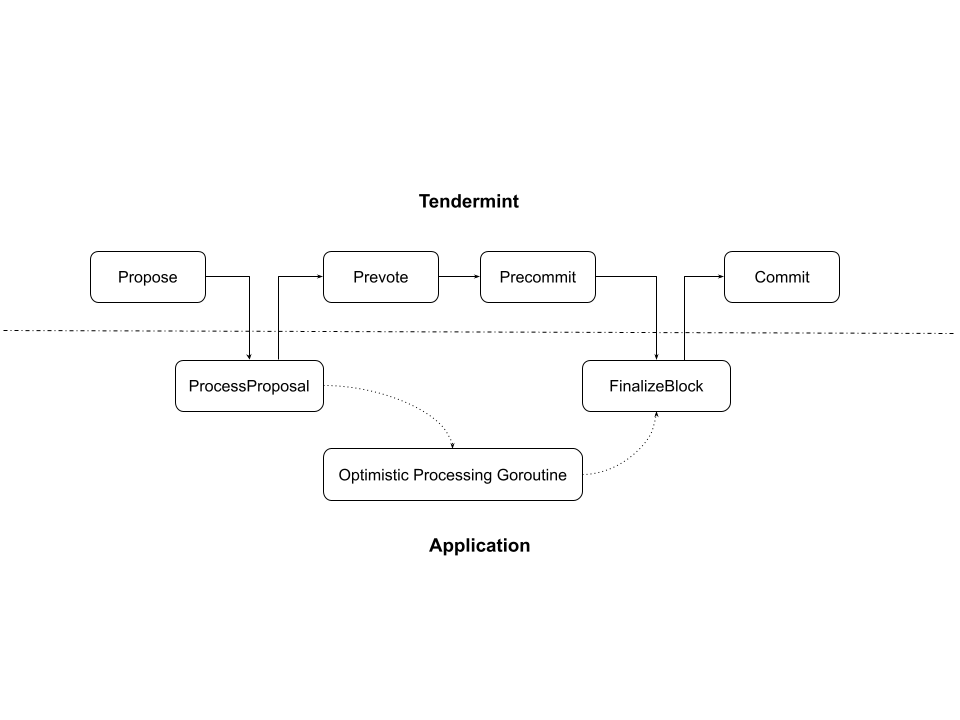

# RFC 000: Optimistic Proposal Processing

## Changelog

- 2022-08-16: Initial draft

## Abstract

This document discusses an optimization of block proposal processing based on
the upcoming Tendermint ABCI++ interface. Specifically, it involves an optimistic
processing mechanism.

## Background

Before ABCI++, the first and only time a Tendermint blockchain's application layer
would know about a block proposal is after the voting period, at which point Tendermint
would invoke `BeginBlock`, `DeliverTx`, `EndBlock`, and `Commit` ABCI methods of
the application, with the block proposal contents passed in.

With the advent of ABCI++, the application layer now has a chance to know about the
block proposal before the voting period commences. This, in theory, presents an
opportunity for the application to optimistically process the block proposal in
parallel with the voting process, thus reducing the overall block time.

## Discussion

ABCI++ introduced a set of new ABCI methods. Among those is `ProcessProposal`, which is
called after a node receives the full block proposal of the current height but before
prevote starts. Tendermint document does state that preemptively processing the proposal
is a potential use case of `ProcessProposal`:
> The Application may fully execute the block as though it was handling `RequestFinalizeBlock`

However, synchronously processing the proposal preemptively would not improve block time
because it would just be changing the ordering of when things happen. Instead, we would
need to make the processing asynchronous: `ProcessProposal` spins off a goroutine whose
termination signal is kept in the application context and responds to Tendermint immediately.
That way, the actual block processing would happen at the same time as voting. When voting
finishes and `FinalizeBlock` is called, the application handler can simply wait for the
previously started goroutine to finish, and flush the resulting cache store if the block
hash matches. Assuming average voting period takes P ms and average block processing takes
Q ms, this would theoretically reduce average block time by `P + Q - max(P, Q)` ms. During
a recent load test on Sei, P was ~600ms and Q was ~300ms, so optimistic processing would
cut the block time by ~300ms in that case.

The following diagram illustrates the intended flow:

In the case where the proposal is rejected during voting, the optimistic processing outcome
obviously needs to be thrown away, which is trivial with states managed by Cosmos thanks to
cache stores, but demands special treatment for Sei's in-memory state in its `dex` module. A
deep copy utility already exists for `dex` in-memory state to make such branching easier. To
prevent a bad actor from exploiting the optimistic processing to overwhelm nodes in the net,
we will only perform optimistic processing for the first round of a height.

Finally, since ABCI++ isn't in any stable release of Tendermint yet and consequently Cosmos
hasn't integrated with ABCI++, Sei would need to directly integrate with ABCI++ based off
development branches of Tendermint if we want this feature out soon.

### Implementation
This proposal can be implemented fully on the application side. The execution context needs to
add the following information:
- whether there is any optimistic processing (OP) goroutine running
- block info (height, round, hash, etc.) of the running OP goroutine, if any
- termination signal
- completion signal
- pointers to branched states

The OP goroutine would operate on top of a cache branch of the Cosmos store, and a branch
equivalent for any state that is not managed by the Cosmos store.

The OP goroutine would periodically (e.g. after every 10 txs) check if a termination signal is sent
to it, and stops if so. If not, the OP goroutine would set the completion signal when it finishes
processing.

To prevent bad validators from overwhelming other nodes, we will only allow optimistic processing
for the first round proposal of a given height.

Upon receiving a `ProcessProposal` call, the application would adopt the following procedure:
> if round == 0 
> &nbsp;&nbsp;&nbsp;&nbsp;set OP fields mentioned above in context 
> &nbsp;&nbsp;&nbsp;&nbsp;create branches for all mutable states 
> &nbsp;&nbsp;&nbsp;&nbsp;kick off an OP goroutine that optimistically process the proposal with the state branches 
> else if block height != OP height in context OR block hash != OP hash in context 
> &nbsp;&nbsp;&nbsp;&nbsp;send termination signal to the running OP goroutine 
> &nbsp;&nbsp;&nbsp;&nbsp;clear up OP fields from the context 
> else 
> &nbsp;&nbsp;&nbsp;&nbsp;do nothing 
> respond to Tendermint

Upon receiving a `FinalizeBlock` call, the application would wait for any OP goroutine if the OP
fields in the context match the information passed in by Tendermint, and merge any resulting branched
states to the main store. If not, `FinalizeBlock` would just process the block by itself.

### References

- [Tendermint ABCI++](https://docs.tendermint.com/master/spec/abci++/abci++_methods.html#new-methods-introduced-in-abci)
- [ABCI++ Timeline](https://blog.cosmos.network/the-tendermint-council-and-the-path-to-delivering-abci-d6deb9e0fc7f)
