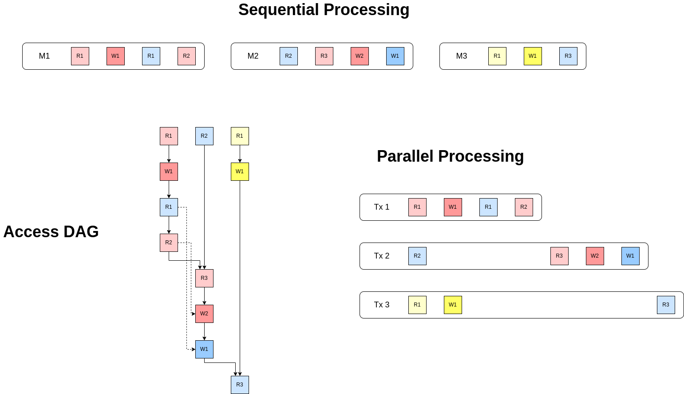

# RFC 001: Parallel Transaction Message Processing

## Changelog

- 2022-09-10: Initial draft

## Abstract

This document discusses a proposal to enable parallel processing of transaction messages in a block safely and deterministically. ABCI++ support is a prerequisite.

## Background


## Discussion

Due to the lightweight nature of goroutines, parallelization itself can be easily achieved by simply running one goroutine per message, without having to maintain some kind of thread pool to control the overhead. The main problem this document addresses is race condition and non-determinism prevention.

Race condition happens when multiple parties access the same resource and one of those parties mutates it. Race condition prevention therefore can only be achieved through serialization of access to the same mutable resource. Moreover, since we also need to achieve determinism, such access serialization should also follow a deterministic ordering. The granularity of accessed resources will affect the effective parallelism; specifically, the finer the granularity, the higher the parallelism. Under the context of a Cosmos-based blockchain, the finest grained mutable resources are individual KV store entries. Nevertheless, the proposed solution would remain its correctness property regardless of the granularity of accessed resource, so in the following discusion we make no assumption of resource granularity.

Moreover, transaction message processing logics currently assume **serializable** isolation level, which entails:
- No dirty read: message A should not see writes from message B before B is finalized.
- No non-repeatable read: message A should not see different results from running the same query multiple times except for the part written by itself.
- No phantom read: message A should not see more or fewer items returned from running the same query multiple times except for the ones inserted/deleted by itself.

These requirements, plus the deterministic serialization requirements from the previous paragraph, can be satisfied if we follow the rules below when coordinating parallel messages **with respective to a given resource** `R`:
- Assuming there are `n` **ordered** messages in a block, where M<sub>i</sub> denotes the `i`-th message:
  - reads and writes of `R` in M<sub>i</sub> form a dependency chain based on the ordering of occurrences of those operations in M<sub>i</sub>'s handler.
  - the first read/write of `R` by M<sub>i</sub> is blocked by the completion of M<sub>j</sub> where `j` is the largest index that 1. is smaller than `i` and 2. M<sub>j</sub> writes to `R`.
  - the first write of `R` by M<sub>i</sub> is additionally blocked by the last read of `R` in M<sub>j</sub> where `j` is the largest index that 1. is smaller than `i` and 2. M<sub>j</sub> reads `R`.
  
If we apply these rules across all messages M<sub>1</sub>, M<sub>2</sub>, ..., M<sub>n</sub> in a block over all relevant resources R<sub>1</sub>, R<sub>2</sub>, ..., we will get a deterministic DAG representing whose nodes represent individual access operations and edges represent dependencies as defined above. 

An example of such DAG over 3 sequential messages and the resulting parallel messages can be found below, where different colors indicate different resources (lighter for reads and darker for writes):



### Implementation
Sei will introduce a new custom module `accesscontrol` which maintains a mapping between every message type and its predetermined resource read/write sequence (we will discuss how such mappings are maintained in later sections).

All message handlers, including ante handlers, will be enhanced such that each resource access is blocked by a list of channels set in its `Context` object, where each channel corresponds to an incoming dependency (edge) to the respective resource access (node) in the access DAG. At the end of each message handler, it will send completion signal for all resources *potentially* written by it. Note that there can be resource access that's part of conditional statements which may not take place in every transaction of the type. In those cases, we would only block if the access is needed, but still signal completion at the end of the message handler. To prevent deadlocks, we should ensure that those signals are set at the end even if the case of panics, with the help of `defer` syntax. In addition, after the *last* read of every resource in a message handler's logic, the message handler would send a completion signal designated for that resource. For example, `Context` for Tx2 in the graph in the previous section will have the following values set:
```
{
    "resource_dependencies": {
        "first_blue_read": [],
        "first_red_read": [chan_msg1_first_red_write],
        "first_red_write": [chan_msg1_second_red_read],
        "first_blue_write": [chan_msg1_first_blue_read]
    },
    "completion_signals": [
        chan_msg2_last_blue_read,
        chan_msg2_last_red_read,
        chan_msg2_red_write,
        chan_msg2_blue_write
    ]
}

Note that the keys in `resource_dependencies` are static for each message type unless it's modified in `accesscontrol` module, whereas the values (i.e. the actual channel lists) are dynamic and will vary block-by-block.

Also note that dependencies from the first rule in the previous section are omitted since they are implicitly satisfied by message handler's execution.
```
As a result, `first_blue_read` will happen immediately and signal completion to `chan_msg2_last_blue_read`. `first_red_read` will happen as soon as it receives completion signal from `chan_msg1_red_write` (which will be sent as soon as M<sub>1</sub>'s handler finalizes, and so on.

Upon receiving a block proposal, the app will first build out the access DAG based on the rules and mapping aforementioned, and validate that the DAG is indeed a DAG, so that there can be no circular dependency that would make deadlock possible. Then it will fire off one goroutine per message with `resource_dependencies` and `completion_signals` set for each message based on the DAG. The app blocks on waiting for all goroutines before responding to Tendermint.
#### Maintain Access Mapping
The keys for access mapping will be in the form of `module-msgtype-subtype`, which can be derived either from reflection or new explicit interface methods on `Msg`. The values will be in the form of `type-id`, where examples for type are `kv`, `dex-mem`, etc., and `id` can be prefixes for `kv` or other point or range identifiers for other resource types.

Mappings for builtin modules are set in genesis and can only be updated via governance. If governance messages themselves have wrong mappings set, the chain may never be recovered, so for safety we will switch to the old sequential execution mode whenever there are governance messages in a block.

Mappings for `wasm` contracts' public endpoints can only be set by contract owners, with keys in the form of `wasm-[code ID]-[instantiate/execute endpoint]` and are required before any of the execution endpoint is usable. Accessible resources for a `wasm` contract include not only its prefix in the `wasm` store and common ante handlers, but also any resource the contract's messages/submessages might access. If messages/submessages are possible, the access mapping should just mark that it could potentially read/write all resources since at the moment we don't have a generic way to know what messages (quantity and ordering) a contract call may produce before actually executing it.

TODO: mappings for EVM/SolanaVM contracts
##### Validation
The `Context` object for each message will also keep a `step` counter that's incremented whenever it signals one completion. The resource stores can then use this `step` counter to validate if the access request is for the correct `step`, and panic if not. If the validation fails, it means that the access mapping for that particular transaction is wrong and needs to be updated before messages for that type can be processed.
