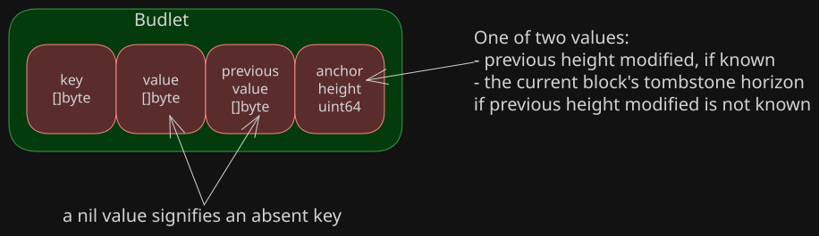
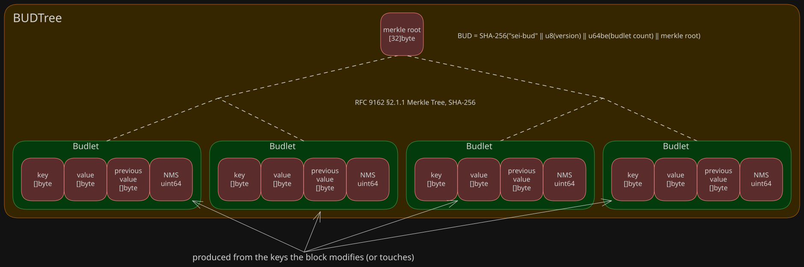
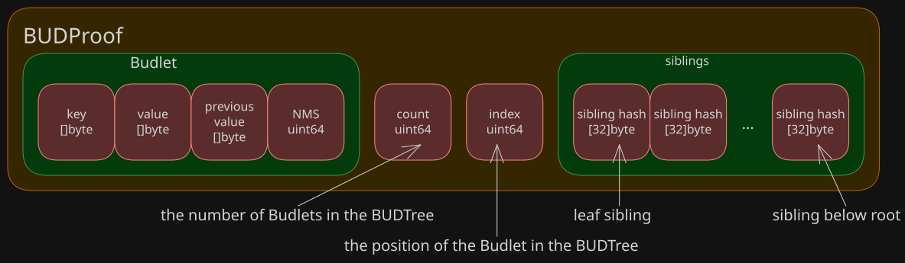
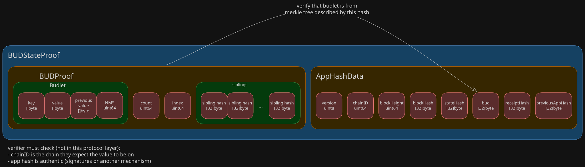

# Block Update Digest

**BUD version:** 1. **BUD proof version:** 1. **BUD state proof version:** 1.

This document defines the Block Update Digest (BUD): a 32-byte commitment to the key-value writes a block
makes. A block's BUD is the `bud` field of its [app hash](../apphash_spec.md). This document
also defines the serialization of a BUD tree; the BUD proof, which proves that one write is among those a BUD
commits to; and the BUD state proof, which combines one or two BUD proofs to prove a key's value over a range of
blocks. It does not define where a BUD tree is stored, or how a reader comes to trust an app hash.

## Notation

- `‖` is byte concatenation.
- `u8(x)` is `x` as a single byte.
- `u32be(x)` is `x` as a 4-byte unsigned big-endian integer.
- `u64be(x)` is `x` as an 8-byte unsigned big-endian integer.
- `SHA-256(x)` is FIPS 180-4 SHA-256, with a 32-byte output. `SHA-256` of the empty string is
  `e3b0c44298fc1c149afbf4c8996fb92427ae41e4649b934ca495991b7852b855`.
- `⊥` is the value of a deleted key. It is distinct from every byte string, including the empty one.
- A *hash* is exactly 32 bytes.
- Byte strings are ordered lexicographically by unsigned byte value, and a proper prefix orders before any
  string it is a prefix of.
- `⌊x / 2⌋` and `⌈x / 2⌉` are integer division rounded down and up.

## Terms

- **budlet:** the triple (`key`, `value`, `previousHeight`) for one key a block modified.
- **BUD tree:** the Merkle tree whose leaves are one block's budlets.
- **BUD:** the hash at the top of a BUD tree.
- **BUD proof:** a budlet together with the proof that it is a leaf of the BUD tree under a given BUD.
- **BUD state proof:** one or two BUD proofs of the same key, each paired with its block's app hash data,
  proving the key's value over a range of block heights.
- **value at a height:** a key's value at height `h` is its value in the state after executing the block at
  height `h`, or `⊥` if the key is absent from that state.

## Budlets



### Purpose

Executing a block yields one budlet for each key it modified. If the block modifies a key more than once, only the
last modification produces a budlet. A budlet records the key's new value and the height at which the key was last
modified before this block, which lets a BUD state proof show that no block in between modified the key.

### Schema

**Version:** BUD version 1.

A budlet is a triple (`key`, `value`, `previousHeight`).

| Element          | Type                    | Meaning                                                           |
|------------------|-------------------------|-------------------------------------------------------------------|
| `key`            | byte string             | The key modified. 1 to 2^32 − 1 bytes.                            |
| `value`          | byte string, or `⊥`     | The value written, 0 to 2^32 − 1 bytes, or `⊥` if deleted.        |
| `previousHeight` | 64-bit unsigned integer | The height of the block that last modified the key, or 0 if none. |

A deletion (`value = ⊥`) and a write of the empty value are different budlets.

#### Serialization

`serialize(b)` is the fields below, in order, with no padding or separators. `⊥` is serialized as a set deletion
flag and a value of length 0. The serialization is also the input to the budlet's leaf hash.

|         Size | Field            | Encoding                                  |
|-------------:|------------------|-------------------------------------------|
|            4 | key length       | `u32be(len(key))`                         |
|   `len(key)` | `key`            | raw bytes                                 |
|            1 | deletion flag    | `u8(1)` if `value = ⊥`, `u8(0)` otherwise |
|            4 | value length     | `u32be(len(value))`, 0 if `value = ⊥`     |
| `len(value)` | `value`          | raw bytes, none if `value = ⊥`            |
|            8 | `previousHeight` | `u64be(previousHeight)`                   |

This is Solidity's
`abi.encodePacked(uint32(key.length), key, deleted, uint32(value.length), value, uint64(previousHeight))`, with
`deleted` as the deletion flag.

The serialization carries no version of its own. It is defined by the BUD version of the BUD tree or BUD proof
that the budlet travels with.

### Verification

An implementation rejects, as an error, a budlet that does not follow the schema above.

A decoder rejects, as an error:

- input that ends before the end of a field
- a deletion flag other than `0` or `1`
- a set deletion flag with a non-zero value length
- a key length of 0

### Test vector

The test vectors in this document use one block of three budlets:

| `b[i]` | `key` (ASCII) | `key` (hex)  | `value`        | `previousHeight`     |
|-------:|---------------|--------------|----------------|----------------------|
|      0 | `evm/a`       | `65766d2f61` | `aabb`         | `0`                  |
|      1 | `evm/b`       | `65766d2f62` | `⊥` (deletion) | `7`                  |
|      2 | `evm/c`       | `65766d2f63` | `cc`           | `0x0102030405060708` |

Their serializations, one column per field, in hex:

| `b[i]` | key length | `key`        | deletion flag | value length | `value` | `previousHeight`   |
|-------:|------------|--------------|---------------|--------------|---------|--------------------|
|      0 | `00000005` | `65766d2f61` | `00`          | `00000002`   | `aabb`  | `0000000000000000` |
|      1 | `00000005` | `65766d2f62` | `01`          | `00000000`   |         | `0000000000000007` |
|      2 | `00000005` | `65766d2f63` | `00`          | `00000001`   | `cc`    | `0102030405060708` |

`serialize(b[i])` in later test vectors stands for the bytes of row `i`.

Verified by [`TestBUDSpecVector`](bud_spec_vector_test.go).

## BUD tree



### Purpose

A block's budlets, arranged as a Merkle tree. Whoever holds a block's BUD tree can build a BUD proof for any of its
budlets, and the tree's root determines the block's BUD.

### Schema

**Version:** BUD version 1.

A block's budlets hold one budlet per key the block modified, in strictly increasing key order.

The hashes of BUD tree nodes are

```
leafHash(b)            = SHA-256(u8(0x00) ‖ serialize(b))
innerHash(left, right) = SHA-256(u8(0x01) ‖ left ‖ right)
```

The leading byte separates leaves from inner nodes, so that no leaf can be presented as an inner node or the
reverse.

The root `R` of the BUD tree over a block's `n` budlets `b[0] … b[n−1]` is computed level by level:

1. If `n = 0`, `R` is 32 zero bytes.
2. Level 0 is `leafHash(b[0]) … leafHash(b[n−1])`.
3. The level above a level of `s > 1` nodes is formed by replacing each pair at positions `(0, 1)`, `(2, 3)`,
   … with `innerHash` of the pair, in order. When `s` is odd, the last node has no pair and is carried up to
   the level above unchanged: it is neither hashed nor duplicated. The level above has `⌈s / 2⌉` nodes.
4. Repeat step 3 until a level has one node. That node is `R`.

When `n = 1`, `R` is the single leaf hash.

*Non-normative:* this is the Merkle Tree Hash of
[RFC 9162 §2.1.1](https://www.rfc-editor.org/rfc/rfc9162#section-2.1.1)
([RFC 6962 §2.1](https://www.rfc-editor.org/rfc/rfc6962#section-2.1)), with `leafHash` and `innerHash` as its leaf
and node hashes and a different value for the empty tree.

*Non-normative:* [BUD tree shapes](bud_tree_shapes.md) shows how to draw the tree for a given `n`.

#### Serialization

A serialized BUD tree is the fields below, in order, with no padding or separators. It holds the budlets only;
the root and inner nodes are recomputed from them.

| Offset |     Size | Field     | Encoding                                     |
|-------:|---------:|-----------|----------------------------------------------|
|      0 |        1 | `version` | `u8`, the BUD version, `1` for this document |
|      1 |        8 | `n`       | `u64be`, the number of budlets               |
|      9 | variable | budlets   | `serialize(b[0]) ‖ … ‖ serialize(b[n−1])`    |

Each budlet's serialization declares its own length, so the budlets need no separators.

### Verification

An implementation rejects, as an error, budlets that are not strictly increasing by key.

A decoder reads `version` from the first byte and rejects any version it does not support. It then rejects, as
an error:

- input shorter than 9 bytes
- input that ends before the `n`th budlet does
- any budlet the budlet decoder rejects
- budlets whose keys are not strictly increasing

### Test vector

The BUD tree over the three budlets of the Budlets test vector. Its leaf hashes are:

```
L0 = leafHash(b[0]) = 35d10b1d4b1150c9e192fd6e3990c335059a082b034552b0c8c5fb84b18b8120
L1 = leafHash(b[1]) = 658e7daf30805c8bea7e7128f4776983b4bfcb2baed616d2ce4aa72c5aa6bb02
L2 = leafHash(b[2]) = c28796d5c82fad7b487cb8abf8141c7a70b593fca1ed6066f910bef4aa873fd3
```

Level 0 is `L0 L1 L2`. Level 1 is `N = innerHash(L0, L1)` followed by `L2`, carried up unpaired. Level 2 is
the root.

```
N = innerHash(L0, L1) = ba10a4fe9d2471b43c2962f3316edc63cca7affe2b6cf3b5d26b2b5dd34356fc
R = innerHash(N, L2)  = 9e7ca3a63b3fe038f0eccb200772166d2c8a4cdaaf9370f8cd19dcfe588944da
```

The serialized BUD tree, one field per line, in hex:

```
version  01
n        0000000000000003
budlets  serialize(b[0])
         serialize(b[1])
         serialize(b[2])
```

A block with no budlets has a root `R` of 32 zero bytes. Its serialized BUD tree is:

```
version  01
n        0000000000000000
```

Verified by [`TestBUDSpecVector`](bud_spec_vector_test.go) and
[`TestBUDSpecEmptyTreeVector`](bud_spec_vector_test.go).

## BUD

### Purpose

The Block Update Digest: a single hash that commits to every write a block made. It is the `bud` field of the
block's app hash data, so anyone who trusts a block's app hash can check BUD proofs against it.

### Schema

**Version:** BUD version 1.

```
BUD = SHA-256("sei-bud" ‖ u8(version) ‖ u64be(n) ‖ R)
```

| Size | Field     | Value                                                                             |
|-----:|-----------|-----------------------------------------------------------------------------------|
|    7 | domain    | the ASCII bytes `sei-bud` (`7365692d627564`), with no terminator or length prefix |
|    1 | `version` | `1`, the BUD version this document defines                                        |
|    8 | `n`       | `u64be` of the number of budlets                                                  |
|   32 | `R`       | the BUD tree root                                                                 |

The domain separates a BUD from every BUD tree node, whose preimages begin with `0x00` or `0x01`, and from
objects of other kinds that commit to a tree of this shape, which use other domains. The BUD commits to `n` so
that a BUD proof cannot claim a different `count` and `index` for the same root.

### Test vector

The BUD of the BUD tree test vector is `SHA-256` of:

| Field     | Bytes (hex)                                                        |
|-----------|--------------------------------------------------------------------|
| domain    | `7365692d627564`                                                   |
| `version` | `01`                                                               |
| `n`       | `0000000000000003`                                                 |
| `R`       | `9e7ca3a63b3fe038f0eccb200772166d2c8a4cdaaf9370f8cd19dcfe588944da` |

which is

```
84f9b7bcac72e99f8e8da42848209a1ec0587f8b8d2b7c4c1e7ba7da9e3bd29f
```

The BUD of a block with no budlets, with `n` = 0 and `R` 32 zero bytes, is

```
3eeeba2dfb311dad9e9e46eba984fa855be2b872496b921b19da52b3eb09d5e2
```

Verified by [`TestBUDSpecVector`](bud_spec_vector_test.go) and
[`TestBUDSpecEmptyTreeVector`](bud_spec_vector_test.go).

## BUD proof



### Purpose

Given a block's BUD, a BUD proof proves two facts about one key:

- in that block, the key was written with a given value
- the key's previous modification was at `previousHeight`, and no block in between modified it

### Schema

**Versions:** BUD proof version 1, BUD version 1.

A BUD proof of budlet `b[i]` in a block of `n` budlets holds:

- `budlet`: `b[i]`.
- `count`: `n`.
- `index`: `i`, the budlet's position in key order.
- `siblings`: the sibling hashes on the way from the budlet's leaf to the root, leaf end first.

The BUD is not part of the proof; the verifier must obtain it from a source it trusts. The serialized proof
names the BUD version it was built under, which also defines how its budlet is serialized and hashed.

#### Siblings

The siblings are taken from the levels of the BUD tree. Start with position `p = i` at level 0, whose size is
`s = n`. While `s > 1`:

1. If `p` is odd, append the node at position `p − 1`.
2. Otherwise, if `p + 1 < s`, append the node at position `p + 1`.
3. Otherwise the node at `p` is carried up unpaired, and nothing is appended.
4. Move to the level above: `p ← ⌊p / 2⌋`, `s ← ⌈s / 2⌉`.

The number of siblings depends only on `count` and `index`. `siblingCount(count, index)` is the number of
iterations of the loop above, run on `p = index` and `s = count`, that append a node. It is at most
`⌈log₂ count⌉`.

#### Serialization

A serialized BUD proof is the fields below, in order, with no padding or separators.

|                              Size | Field        | Encoding                                           |
|----------------------------------:|--------------|----------------------------------------------------|
|                                 1 | `version`    | `u8`, the BUD proof version, `1` for this document |
|                                 1 | `budVersion` | `u8`, the BUD version, `1` for this document       |
|                          variable | `budlet`     | `serialize(budlet)`                                |
|                                 8 | `count`      | `u64be`                                            |
|                                 8 | `index`      | `u64be`                                            |
| `32 × siblingCount(count, index)` | `siblings`   | each hash's 32 raw bytes, in order                 |

The budlet declares its own length and `count` and `index` determine the number of siblings, so a serialized
BUD proof needs no length prefix to be embedded in a larger format.

### Verification

A decoder reads `version` from the first byte and rejects any version it does not support. It then rejects, in
order:

1. input that ends before `budVersion`
2. a `budVersion` it does not support
3. a budlet the budlet decoder rejects
4. input that ends before the end of `index`
5. an `index` not less than `count`
6. input that ends before the last sibling

Each rejection is an error, distinct from a proof that decodes but computes the wrong BUD.

#### Computing the BUD

A BUD proof (`budlet`, `count`, `index`, `siblings`) determines a BUD. The decoder has already ensured that:

- `budlet` satisfies the bounds in [Budlets](#budlets)
- `index < count`
- `siblings` holds exactly `siblingCount(count, index)` hashes

1. Let `h = leafHash(budlet)`, `p = index`, `s = count`, and `k = 0`. While `s > 1`:
   - If `p` is odd: `h ← innerHash(siblings[k], h)`, and `k ← k + 1`.
   - Otherwise, if `p + 1 < s`: `h ← innerHash(h, siblings[k])`, and `k ← k + 1`.
   - Then `p ← ⌊p / 2⌋` and `s ← ⌈s / 2⌉`.
2. The computed BUD is `SHA-256("sei-bud" ‖ u8(1) ‖ u64be(count) ‖ h)`.

The proof shows that a block wrote `budlet` when the computed BUD equals that block's BUD, obtained from a source
the verifier trusts. A mismatch is a failed proof, not an error.

### Test vector

The BUD proofs of the three budlets of the BUD tree test vector, one field per line, in hex. `serialize(b[i])`
stands for the bytes in the Budlets test vector, and `L0`, `L1`, `L2`, and `N` for the hashes in the BUD tree
test vector.

BUD proof of `b[0]`:

```
version     01
budVersion  01
budlet      serialize(b[0])
count       0000000000000003
index       0000000000000000
siblings    L1
            L2
```

BUD proof of `b[1]`:

```
version     01
budVersion  01
budlet      serialize(b[1])
count       0000000000000003
index       0000000000000001
siblings    L0
            L2
```

BUD proof of `b[2]`:

```
version     01
budVersion  01
budlet      serialize(b[2])
count       0000000000000003
index       0000000000000002
siblings    N
```

The proof of `b[2]` has one sibling, because `L2` is carried up unpaired from level 0.

Verified by [`TestBUDSpecVector`](bud_spec_vector_test.go).

## BUD state proof



### Purpose

A BUD state proof proves the value of one key over a range of block heights, given that the verifying party can:

- authenticate the app hash of each block in the proof
- confirm that the blocks' `chainID` is the chain they expect

The verifier needs no state of its own and executes no blocks.

### Schema

**Version:** BUD state proof version 1.

A BUD state proof holds one or two pairs, each of a block's app hash data and a BUD proof against the BUD in it.
App hash data and its serialization are defined by the
[Giga app hash specification](../apphash_spec.md); its `blockHeight` field is the height of the
block and its `bud` field the block's BUD.

- **One pair**, for budlet `a` in the block at height `hA`: the key `a.key` held `a.value` at `hA`.
- **Two pairs**, for budlet `a` at height `hA` followed by budlet `b` at height `hB`: the key `a.key` held
  `a.value` at every height from `hA` up to but not including `hB`, and `b.value` at `hB`.

#### Serialization

A serialized BUD state proof is a header followed by `n` pairs, with no padding or separators.

| Size | Field     | Encoding                                                 |
|-----:|-----------|----------------------------------------------------------|
|    1 | `version` | `u8`, the BUD state proof version, `1` for this document |
|    1 | `n`       | `u8`, the number of pairs, `1` or `2`                    |

Each pair, in height order:

|                Size | Field               | Encoding                               |
|--------------------:|---------------------|----------------------------------------|
|                   4 | `appHashDataLength` | `u32be` of the length of `appHashData` |
| `appHashDataLength` | `appHashData`       | the app hash data serialization        |
|            variable | `budProof`          | the BUD proof serialization            |

`appHashDataLength` exists only in this format. It is not part of any hashed or signed bytes, and lets a
decoder find the end of `appHashData` without knowing its size for each app hash version.

### Verification

An implementation rejects, as an error, a BUD state proof that does not satisfy every condition below.

- For each pair, the BUD [computed](#computing-the-bud) from its BUD proof equals the `bud` of its app hash data.
- With two pairs:
  - `a.key = b.key`.
  - `hA < hB`.
  - `b.previousHeight = hA`, so that no block between `hA` and `hB` modified the key.
  - Both app hash data have the same `chainID`.

A decoder reads `version` from the first byte and rejects any version it does not support. It then rejects, as
an error:

- input that ends before `n`
- an `n` other than `1` or `2`
- input that ends before a length prefix, or before the end of the app hash data it declares
- app hash data the app hash decoder rejects
- a BUD proof the BUD proof decoder rejects
- pairs that violate the conditions above

#### Trust

A BUD state proof that satisfies these conditions is consistent, which alone proves nothing. The verifier must
also authenticate the app hash of each pair's app hash data through a protocol outside this document.

### Test vector

This vector proves the value of `evm/b` from height 7 through height 9, on chain ID `0x1112131415161718`.

- The block at height 9 is the block of the Budlets test vector. Its `b[1]` deletes `evm/b`, with
  `previousHeight` 7.
- The block at height 7 has one budlet, `c`: `key` `evm/b`, `value` `bb`, `previousHeight` 0.

The height-7 block, in hex. With one budlet, its BUD tree root is the budlet's leaf hash.

```
serialize(c)     = 00000005 65766d2f62 00 00000001 bb 0000000000000000
R7 = leafHash(c) = 1972da2c96a40269ddcd0ba29f92f10524fb0c2fc887d8fd5f92d5092c6ce323
BUD7             = 8e8700ec280c2c50dab3033731c23e42ed19f966045a78846345e0b9faf069f4
```

`BUD9` is the BUD of the BUD test vector, `84f9b7bcac72e99f8e8da42848209a1ec0587f8b8d2b7c4c1e7ba7da9e3bd29f`.

The app hash data of the two blocks, in hex. `appHashData7` and `appHashData9` stand for their serializations.

| Field             | Height 7             | Height 9             |
|-------------------|----------------------|----------------------|
| `version`         | `01`                 | `01`                 |
| `chainID`         | `1112131415161718`   | `1112131415161718`   |
| `blockHeight`     | `0000000000000007`   | `0000000000000009`   |
| `blockHash`       | 32 bytes of `a7`     | 32 bytes of `a9`     |
| `stateHash`       | 32 bytes of `b7`     | 32 bytes of `b9`     |
| `bud`             | `BUD7`               | `BUD9`               |
| `receiptHash`     | 32 bytes of `d7`     | 32 bytes of `d9`     |
| `previousAppHash` | 32 bytes of `e7`     | 32 bytes of `e9`     |

Their app hashes, which the verifier must authenticate:

```
appHash7 = 6b0549eb2057bb970ef17a2ace1feeec1aa592e0c2cc1667744b89958204a943
appHash9 = 84016c34d2bc2ca0bed325790ab94d8a7838fbf6066c252f94cae1731e49dab4
```

The serialized BUD state proof, one field per line, in hex:

```
version                01
n                      02
pair 0
  appHashDataLength    000000b1
  appHashData          appHashData7
  budProof
    version            01
    budVersion         01
    budlet             serialize(c)
    count              0000000000000001
    index              0000000000000000
    siblings           (none)
pair 1
  appHashDataLength    000000b1
  appHashData          appHashData9
  budProof             the BUD proof of b[1] from the BUD proof test vector
```

It proves that `evm/b` held `bb` at heights 7 and 8, and was deleted at height 9.

Verified by [`TestBUDSpecStateProofVector`](bud_spec_vector_test.go). More vectors are in
`testdata/golden/bud-v1-proof-v1-state-proof-v1.json`, verified by [`TestBUDGolden`](bud_golden_test.go).
