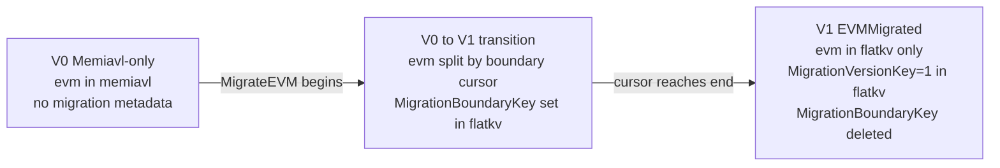

# MigrateEVM Operations Roadmap

This document is the operational companion to [README.md](README.md). README explains *what* the migration is and *how* the data path is wired; this document explains *what can go wrong*, *how to detect it*, *how to repair it*, and *what tooling needs to exist* to make MigrateEVM (V0 -> V1) safe to operate in production and reproducible in CI.

It is deliberately scoped to **MigrateEVM only** (the V0 -> V1 transition that moves the `evm/` module from memiavl to flatkv). The same framework will apply to MigrateAllButBank (V1 -> V2) and MigrateBank (V2 -> V3) but those are out of scope for the first iteration.

---

## 1. Scope

MigrateEVM is the first of three migrations defined in [migration_versions.go](migration_versions.go):

- `Version0_MemiavlOnly = 0` -- pre-migration. All modules in memiavl.
- `Version1_MigrateEVM  = 1` -- post-migration. `evm/` lives in flatkv; everything else still in memiavl.

The transition between them is driven by `MigrationManager.ApplyChangeSets`, configured via `WriteMode = MigrateEVM` (see [write_mode.go](write_mode.go) and `buildMigrateEVMRouter` in [router_builder.go](router_builder.go)).

This roadmap covers operations that touch the `evm/` module's storage during and around that transition. It does **not** cover EVM execution semantics, JSON-RPC behavior, or non-EVM modules.

---

## 2. Lifecycle Reference



Migration metadata (`MigrationVersionKey`, `MigrationBoundaryKey`) lives exclusively in flatkv's `MigrationStore`. memiavl never owns a `migration` tree; an absent `MigrationVersionKey` on flatkv is interpreted as the active mode's `startVersion`.

| Stage | evm in memiavl | evm in flatkv | `MigrationVersionKey` | `MigrationBoundaryKey` | Data path |
|---|---|---|---|---|---|
| **V0** | full | empty | absent (no migration metadata) | absent | direct memiavl; `BuildRouter` not called (see README sec "Version 0") |
| **transition** | keys with logical_k > boundary | keys with logical_k <= boundary | absent in flatkv until the final block | serialized `MigrationBoundary` in flatkv `MigrationStore` | `MigrationManager` routes by boundary |
| **V1** | empty (modulo cleanup) | full | `1` in flatkv | absent (deleted on final block) | `buildEVMMigratedRouter`: evm direct to flatkv |

Authoritative source for the boundary key handling: [migration_manager.go:371-394](migration_manager.go).

---

## 3. Atomicity & Crash-Safety Statement

The single most important fact for understanding the failure modes below:

> `MigrationManager.ApplyChangeSets` writes to memiavl and flatkv in **two parallel goroutines** ([migration_manager.go:396-426](migration_manager.go)). The interface contract on `DBWriter` explicitly states *"May not be atomic. If not atomic, then the caller must provide crash safe atomicity."* ([migration_types.go:39-40](migration_types.go)).

Per-block guarantees:
- **memiavl writer** applies `oldDBChangeSet`: deletions of the migrated batch + any incoming user writes routed to memiavl.
- **flatkv writer** applies `newDBChangeSets`: inserts for the migrated batch + any incoming user writes routed to flatkv + the new `MigrationBoundaryKey` (or, on the final block, `MigrationVersionKey=1` and a delete of the boundary).
- The two writers can finish in either order. If the process dies between them, on-disk state is split.

The `MigrationManager` does not implement a write-ahead log of its own; it relies on memiavl's existing changelog WAL for one side and flatkv's commit-snapshot mechanism for the other. There is no two-phase commit across them.

This is the physical root cause of `A1`, `A2`, and `A3` below.

---

## 4. Failure Mode Catalog

Each entry uses this format:

- **Trigger** -- what physical event causes the failure
- **Disk symptom** -- what an operator would observe on disk
- **User symptom** -- what an end-user (RPC caller) would observe
- **Self-recoverable?** -- whether normal restart + continued block production fixes it
- **Detection signal** -- how to tell from outside that this happened
- **Recovery path** -- the sequence of operator/tool steps to fix

### A1 -- Lost-batch crash (memiavl wrote, flatkv didn't)

- **Trigger**: process killed after memiavl writer commits the batch deletion but before flatkv writer commits the corresponding insert + boundary advance.
- **Disk symptom**: the migrated batch's evm keys are absent from memiavl (deleted) and absent from flatkv (never inserted). `MigrationBoundaryKey` is at the *previous* batch.
- **User symptom**: those evm keys read as missing. Smart-contract calls touching them revert or read zero.
- **Self-recoverable?** **No** by `MigrationManager` itself. memiavl's WAL replay restores the *committed* state (post-deletion); it does not put the keys back.
- **Detection signal**: post-restart, walk memiavl evm and flatkv evm; the *union* is missing keys that exist in any pre-migration backup or peer node at the same height.
- **Recovery path**: state-sync from a peer at a >= V1 height; or, if a pre-migration memiavl backup exists, restore it and replay changesets via `replay-changelog`.

### A2 -- Stale-residue crash (flatkv wrote, memiavl didn't)

- **Trigger**: process killed after flatkv writer commits the batch insert + new `MigrationBoundaryKey` but before memiavl writer commits the corresponding deletions.
- **Disk symptom**: migrated batch keys exist in *both* memiavl and flatkv. `MigrationBoundaryKey` claims the batch is migrated.
- **User symptom**: none -- `MigrationManager.Read` consults the boundary first, routes the read to flatkv (newDB), and returns the correct value. Memiavl residue is invisible to consumers.
- **Self-recoverable?** **Yes for correctness, no for disk usage.** Block production continues correctly; memiavl just keeps stale rows around forever.
- **Detection signal**: walk memiavl evm at any later block; any key whose logical_k <= boundary cursor is residue. After V1 reaches steady state (boundary deleted, `MigrationVersionKey=1`), *every* memiavl evm key is residue.
- **Recovery path**: tool to walk memiavl evm and delete keys covered by the boundary (or all keys, in V1). Disk-only repair; no consensus-visible state changes.

### A3 -- Boundary key corruption

- **Trigger**: media corruption / partial-write / human error truncating or mutating `MigrationBoundaryKey` in the flatkv `MigrationStore`.
- **Disk symptom**: `MigrationBoundaryKey` either deserializes to an out-of-range cursor, fails to deserialize at all, or claims a position inconsistent with what memiavl/flatkv physically contain.
- **User symptom**: depending on the corruption: reads route to wrong DB; node refuses to start when `readMigrationBoundary` returns an error in [migration_manager.go:212-225](migration_manager.go).
- **Self-recoverable?** **No**.
- **Detection signal**: deserialize fails on startup; or boundary deserializes but invariant `for every evm key K, K is in exactly one of {memiavl, flatkv}` is violated.
- **Recovery path**: stop the node; reconstruct the cursor by walking both DBs and choosing the cursor consistent with the actual key partition; re-write `MigrationBoundaryKey`. Requires a tool (no current way to do this safely).

### B1 -- Mid-migration snapshot creation

- **Trigger**: operator runs cosmos-sdk snapshot at a height when MigrateEVM is in progress.
- **Disk symptom** (intended): a snapshot blob containing both memiavl evm > boundary and flatkv evm <= boundary, plus the boundary itself, plus all other modules from memiavl.
- **Risk**: [composite/store.go](../composite/store.go) attaches `flatkvExporter` whenever `cs.flatKV != nil`, i.e. for every `WriteMode` except `MemiavlOnly`. During `MigrateEVM` `cs.flatKV` is non-nil, so the exporter does emit flatkv rows. What remains unverified is whether the *assembled* snapshot (memiavl evm > boundary + flatkv evm <= boundary + boundary metadata + non-evm modules) round-trips cleanly through `composite.Importer` and lands a peer at an equivalent mid-migration state. This is an open question (sec 8).
- **User symptom**: a peer that restores from this snapshot may not converge to a state matching the source.
- **Self-recoverable?** Not applicable.
- **Detection signal**: on the receiving side, `composite.Importer` finishes but post-restore consistency checks (sec 6 / T2) report disagreement.
- **Recovery path**: do not snapshot mid-migration until exporter coverage is confirmed; or fix exporter; or document an operational rule.

### B2 -- Mid-migration state-sync receive

- **Trigger**: a node at V0 or in transition receives state-sync from a peer at V1.
- **Disk symptom** (intended): receiver's `composite.Importer` ([composite/store.go](../composite/store.go)) opens both cosmos and flatkv importers (each gated on the matching backend being non-nil); cosmos receives the non-evm portion, flatkv receives the evm portion. flatkv's `resetForImport` wipes the receiver's flatkv first; cosmos applies the snapshot to memiavl (which presumably also resets evm). On finalize, `MigrationVersionKey=1` is written to flatkv `MigrationStore`.
- **Risk**: the cosmos side of the importer needs to *not* leave residual evm keys in memiavl. If memiavl is not reset for the evm module specifically, the receiver lands in `A2`-equivalent state immediately on restore.
- **User symptom**: post-restore, evm queries return correct values (routed to flatkv via V1's `buildEVMMigratedRouter`) but memiavl carries garbage.
- **Self-recoverable?** Yes, but disk-wasteful, same as `A2`.
- **Detection signal**: post-state-sync, walk memiavl evm; in V1 it should be empty.
- **Recovery path**: reuse the `A2` cleanup tool.

### C1 -- flatkv corruption after V1

- **Trigger**: post-V1, the flatkv directory is partially or fully lost (disk failure, accidental `rm -rf`).
- **Disk symptom**: missing or broken flatkv data DBs; memiavl unchanged but already empty for `evm/`.
- **User symptom**: evm reads fail or return missing data.
- **Self-recoverable?** **No**, and *not locally recoverable*: memiavl no longer has the source data after V1.
- **Detection signal**: flatkv fails to open / startup panic.
- **Recovery path**: state-sync from a peer at >= V1. The local-import tool from this branch (`import-flatkv-from-memiavl`) **cannot help** post-V1 because memiavl is empty. The only local fallback is restoring from a pre-V1 memiavl snapshot plus changeset replay, which is rarely available in production.

### C2 -- memiavl evm residue after V1 (lingering A2)

- **Trigger**: any uncleaned-up `A2` from the transition phase, or a `B2`-equivalent state-sync that did not wipe memiavl evm.
- **Disk symptom**: memiavl evm contains keys; `MigrationVersionKey=1` so router sends evm reads to flatkv.
- **User symptom**: none.
- **Self-recoverable?** No.
- **Detection signal**: count of evm keys in memiavl > 0 in V1.
- **Recovery path**: same tool as `A2` cleanup.

### C3 -- V1 completion audit

- **Trigger**: not a failure per se -- an operator/CI wants to verify "we landed at V1 correctly and did not drop anything during the transition".
- **Invariant**: `set(evm keys in flatkv at V1) == set(evm keys in memiavl at V0_pre_migration) evolved by all changesets between V0 start height and V1 final height`.
- **Detection signal**: a digest computed over flatkv@V1 evm matches an externally-recorded ground-truth digest for that height.
- **Recovery path**: not a recovery; an audit. Failure here implies an unnoticed `A1` or worse.

---

## 5. Existing Tooling Inventory

The 14 subcommands registered in [main.go](../../../tools/cmd/seidb/main.go), filtered to the ones touching evm-relevant state:

| Tool | Backend | Primitive | Migration-aware? |
|---|---|---|---|
| `dump-iavl` ([dump_iavl.go](../../../tools/cmd/seidb/operations/dump_iavl.go)) | memiavl | inspect: dump module to file | No |
| `dump-flatkv` ([dump_flatkv.go](../../../tools/cmd/seidb/operations/dump_flatkv.go)) | flatkv | inspect: dump bucket to file | No |
| `state-size` ([state_size.go](../../../tools/cmd/seidb/operations/state_size.go)) | memiavl | measure | No |
| `flatkv-state-size` ([flatkv_state_size.go](../../../tools/cmd/seidb/operations/flatkv_state_size.go)) | flatkv | measure | No |
| `prune` ([prune.go](../../../tools/cmd/seidb/operations/prune.go)) | SS only | repair: prune at a version (whole DB) | No |
| `replay-changelog` ([replay_changelog.go](../../../tools/cmd/seidb/operations/replay_changelog.go)) | memiavl WAL | reconstruct: replay raw changelog | No |
| `import-flatkv-from-memiavl` ([import_flatkv_from_memiavl.go](../../../tools/cmd/seidb/operations/import_flatkv_from_memiavl.go)) | both | rebuild: import evm from memiavl into flatkv | Partially (writes to flatkv only; does not set `MigrationVersionKey`) |

Library-level infrastructure that exists but has no operator entry point:

- [composite.CompositeCommitStore.Exporter](../composite/store.go) -- snapshot export; emits memiavl rows iff `cs.memIAVL != nil` (every `WriteMode` except `FlatKVOnly`) and flatkv rows iff `cs.flatKV != nil` (every `WriteMode` except `MemiavlOnly`)
- [composite.CompositeCommitStore.Importer](../composite/store.go) -- snapshot import receiver (state-sync); same per-backend gating as the exporter
- [flatkv.CommitStore.Importer](../flatkv/store.go) -- the flatkv side of state-sync receive (also used by the import tool above)
- [flatkv.resetForImport](../flatkv/store.go) -- wipe-before-restore primitive

**Observation**: every existing tool operates on *one DB* and is *unaware of the boundary*. There is no tool that takes "memiavl + flatkv + boundary" as a single coherent system. That is the gap this roadmap fills.

---

## 6. Tool Roadmap

Four tool classes. Each section gives: command shape, purpose, inputs, outputs, audience, safety rails, failure-mode coverage, library dependencies, complexity, and at least five acceptance criteria.

### T1 -- `seidb migrate-evm-status`

**Purpose**: read-only summary of "where is this node in the MigrateEVM lifecycle". The `git status` for migration.

**Inputs**:
- `--data-dir` / `--home`: same resolution rules as existing `import-flatkv-from-memiavl`.
- (no version flag; reads whatever is on disk *now*).

**Outputs (stdout, machine-parseable line-oriented + human header)**:
```
stage           : transition | v0 | v1 | unknown
migration-version : 0 | 1 | <raw>
boundary        : not-started | <serialized hex> | not-set | unparseable
memiavl-evm-keys: <int>
flatkv-evm-keys : <int>
consistency-flag-keys-in-both: <int>     # >0 indicates A2-style residue
consistency-flag-keys-in-neither: unknown # cannot detect without external GT
```

Exit code 0 if successfully read; non-zero if either DB cannot be opened.

**Audience**: operator (pre-flight on incident response), CI (smoke-check before/after migration in integration tests).

**Safety rails**: read-only; opens DBs read-only via the same path the existing dump tools use.

**Coverage**: detection portion of `A2`/`C2` (via `keys-in-both`), `A3` (via boundary parse status). Does not detect `A1`. Does not run the heavyweight invariant check (that's T2).

**Library dependencies**:
- `flatkv.LoadCommitStore` for opening flatkv read-only
- memiavl exporter / equivalent for opening memiavl read-only (only needed for `keys-in-both` and similar invariants; migration metadata itself lives only on flatkv)
- direct `MigrationStore` reads using `readVersionFromDB` / `readMigrationBoundary` from [migration_manager.go](migration_manager.go) against the flatkv reader -- these are package-private, so a small public helper in the migration package needs to be exposed.

**Complexity**: ~150 LOC + ~80 LOC for the migration-package helper. ~100 LOC tests.

**Acceptance criteria**:
1. `migrate-evm-status` against a clean V0 setup prints `stage: v0`, version `0`, boundary `not-started`.
2. Against a setup with `MigrationBoundaryKey` set and `MigrationVersionKey` absent in flatkv prints `stage: transition` and the boundary's stringified form.
3. Against a setup with `MigrationVersionKey=1` in flatkv and no boundary prints `stage: v1`.
4. `consistency-flag-keys-in-both` is `0` for a freshly imported V0 (no overlap) and `>0` for a synthetically corrupted state where a key was inserted into both DBs.
5. Output schema is stable across calls and documented in command help; CI assertions can grep individual lines.
6. Missing flatkv dir is reported as a clear error, not a panic.
7. Read-only: never opens either DB in writable mode (verified by acceptance test that mounts the data dir read-only and confirms success).

### T2 -- `seidb migrate-evm-verify`

**Purpose**: run an invariant check across the (memiavl, flatkv, boundary) triple, with three modes for three lifecycle situations.

**Inputs**:
- `--data-dir` / `--home`
- `--mode={completion-check, union-invariant, ground-truth}` (required)
- `--ground-truth-digest=<hex>` (required only with `--mode=ground-truth`)
- `--max-divergence-samples=N` (default 10): on failure, print up to N specific diverging keys for debugging

**Modes**:

- `--mode=completion-check` -- intended for V1 audit (`C3`):
  - require `MigrationVersionKey=1` and boundary absent
  - require `memiavl evm key count == 0`
  - report `flatkv evm key count`
- `--mode=union-invariant` -- intended for transition stage (`A1`/`A2`/`A3` detection):
  - require boundary present
  - for each key in memiavl evm: assert logical_k > boundary
  - for each key in flatkv evm: assert logical_k <= boundary
  - require: no key appears in both
- `--mode=ground-truth` -- intended for `C3` extended audit, or post-DR verification:
  - compute LtHash over current `(physical_k, encoded_v)` set (using `RawGlobalIterator` from [flatkv/store_read.go](../flatkv/store_read.go) for flatkv; using `MultiTreeExporter` + `ImportTranslator` for memiavl evm if any remaining)
  - compare to `--ground-truth-digest`

Exit 0 on pass, non-zero on any failure. On non-zero, print up to `N` divergent samples plus a one-line summary.

**Audience**: CI for `union-invariant` and `completion-check`; operator for `ground-truth` post-DR.

**Safety rails**: read-only; never writes.

**Coverage**:
- `union-invariant`: detection of `A1` (keys in neither side -- visible as count below expected if combined with external GT, otherwise not), `A2` (keys in both), `A3` (any key violating boundary partition)
- `completion-check`: `C2` and `C3` (detects residue and confirms completion)
- `ground-truth`: definitive `C3` audit when a trusted digest is available

**Library dependencies**:
- T1's package-private migration helpers (boundary read)
- `flatkv.RawGlobalIterator` (returns a positioned `dbm.Iterator` and error over all data DBs in global lex order; use `for ; iter.Valid(); iter.Next()`)
- `memiavl.NewMultiTreeExporter` for the memiavl-evm walk
- `flatkv.NewImportTranslator` for the memiavl -> physical-key mapping (`ground-truth` mode only)
- `flatkv/lthash` for the digest

**Complexity**: ~300 LOC + ~250 LOC tests. The `union-invariant` mode is the largest piece because it must classify each iterator key against a deserialized boundary.

**Acceptance criteria**:
1. `completion-check` succeeds on a freshly imported, marked-as-V1 state.
2. `completion-check` fails with `keys-in-memiavl: <N>` when stale evm exists in memiavl post-V1 (synthetic residue).
3. `union-invariant` succeeds on a synthetic mid-migration setup where the boundary is consistent with the partition, and fails when one key is moved from flatkv to memiavl (simulating `A2`).
4. `ground-truth` succeeds when fed the digest produced by the same tool against a reference state, and fails (with sample listing) when a single byte is mutated in any value.
5. Modes are mutually exclusive; help text explicitly lists which failure-mode IDs each mode targets.
6. On failure, divergent-sample output is deterministic given the same inputs (sorted by physical key).
7. Read-only verified by acceptance test mounting data dir read-only.

### T3 -- `seidb migrate-evm-reconcile`

**Purpose**: actually repair the kinds of damage T1/T2 detect. Default-`--dry-run`, never destructive without explicit `--apply`.

**Subcommands** (or sub-flags; design choice deferred to PR):

- `migrate-evm-reconcile clean-stale-memiavl`:
  - read boundary (or, if absent and `MigrationVersionKey=1`, treat all memiavl evm as stale)
  - identify keys in memiavl evm whose logical_k <= boundary (or all of them in V1)
  - default: print plan
  - `--apply`: delete those keys from memiavl, transactional within memiavl's commit semantics
  - covers `A2` cleanup and `C2`
- `migrate-evm-reconcile recompute-boundary`:
  - require `MigrationVersionKey` absent in flatkv (i.e., the chain has not yet finalized to V1) and `MigrationBoundaryKey` either absent or unparseable
  - walk both DBs; if `{memiavl evm} cap {flatkv evm} != empty`, refuse
  - else compute boundary as max(flatkv keys) (or whatever the canonical boundary form is); print plan
  - `--apply`: write the new boundary
  - covers `A3`

**Inputs**: `--data-dir` / `--home`; subcommand-specific flags above; `--apply` (default false); `--confirm-destructive` (required with `--apply`).

**Outputs**: dry-run plan text on stdout; on `--apply`, post-condition summary.

**Audience**: primarily operators in DR. CI uses it negatively (assert that without `--apply` no on-disk change occurred).

**Safety rails**:
- defaults to dry-run
- `--apply` requires `--confirm-destructive`
- requires that `seid` is not running (file lock check via opening the DB writable; if locked, refuses)
- always emits a `before/after` diff to stdout when applying
- never operates on flatkv writes (we never delete from flatkv in this tool; flatkv is the source of truth post-V1)

**Coverage**: repair side of `A2`, `A3`, `C2`.

**Library dependencies**: memiavl writable open + delete API; migration helpers for boundary read/write.

**Complexity**: ~400 LOC + ~300 LOC tests. The `recompute-boundary` mode is small but has to be cautious about edge cases (empty flatkv, partial overlap).

**Acceptance criteria**:
1. Without `--apply`, never changes either DB's bytes (acceptance test diffs the data dir before/after).
2. `clean-stale-memiavl --apply` deletes exactly the keys identified in dry-run; idempotent on re-run (second invocation reports no deletions).
3. `recompute-boundary --apply` reproduces the boundary key bytes that would have existed had the original `MigrationManager` advance committed normally (compare against a known-good fixture).
4. Refuses to operate when `seid` holds the lock (acceptance test starts a sentinel reader holding an exclusive lock and asserts the tool refuses).
5. Refuses `recompute-boundary` when `{memiavl evm} cap {flatkv evm} != empty`, emitting a clear "irreconcilable; rerun T2 union-invariant" message.
6. After `clean-stale-memiavl --apply` followed by `migrate-evm-status`, `consistency-flag-keys-in-both == 0`.
7. Documented in command help that this is destructive; help text lists prerequisites.

### T4 -- `import-flatkv-from-memiavl` extension flags

**Purpose**: use the existing import tool as a fixture-builder for V1 and mid-migration test scenarios.

**New flags on the existing command** ([import_flatkv_from_memiavl.go](../../../tools/cmd/seidb/operations/import_flatkv_from_memiavl.go)):

- `--mark-as-migrated=evm`:
  - after the existing import completes successfully, write `MigrationVersionKey=Version1_MigrateEVM=1` into flatkv `MigrationStore`
  - covers test fixture #11 (seed a V1 node directly without running migration)
  - **does not** touch memiavl; for a clean V1 fixture the caller must also ensure memiavl has no evm (either fresh memiavl or run T3 clean-stale-memiavl)
- `--up-to-boundary=<hex>`:
  - filter the memiavl walk to only emit keys with logical_k <= boundary
  - after import, write the boundary into flatkv `MigrationStore` (do not write `MigrationVersionKey`; an absent key denotes the pre-V1 state)
  - covers test fixture #12 (seed a mid-migration node)

Both flags are off by default; default behavior of `import-flatkv-from-memiavl` is unchanged.

**Audience**: primarily CI / dev test fixtures. Operators in DR scenarios should not need either flag.

**Safety rails**: both flags require `--force` (matching the existing tool's posture about overwriting flatkv); `--mark-as-migrated` requires that the import step succeeded (no marking on partial imports). If `Abort` was triggered, no metadata is written.

**Coverage**: test-side coverage of #11 (`--mark-as-migrated`) and #12 (`--up-to-boundary`).

**Library dependencies**: existing import path; flatkv `Set`/`Commit` for the metadata write.

**Complexity**: ~80 LOC + ~120 LOC tests.

**Acceptance criteria**:
1. Default invocation (no new flags) is byte-identical to the previous behavior; existing tests still pass without modification.
2. `--mark-as-migrated=evm` post-import: `MigrationVersionKey=1` is present in flatkv `MigrationStore`; `migrate-evm-status` reports `stage: v1`.
3. `--mark-as-migrated=evm` after a failing import (Abort path) does not write `MigrationVersionKey`.
4. `--up-to-boundary=<hex>`: after import, flatkv contains exactly the keys with logical_k <= boundary, no more, no fewer; boundary in `MigrationStore` matches the flag.
5. `--up-to-boundary` plus `migrate-evm-status` reports `stage: transition` with the same boundary.
6. Both flags can be combined sensibly only if the user understands the result; if combined, the tool emits a warning explaining the resulting state is not reachable through normal MigrateEVM execution.

---

## 7. Suggested Sequencing

Order matters because each step's verification leans on the previous step's tools.

1. **T1 (status)** -- foundational. Tiny, read-only, immediately useful to attach to any incident response. Also unblocks T2 and T3 by providing the boundary-read helper.
2. **T2 completion-check sub-mode** -- smallest verify mode, depends only on T1 helpers. Once landed, attach to the existing docker integration test so the post-import smoke check upgrades from "6 RPC samples" to "memiavl evm count is zero + flatkv evm count is non-zero + V1 metadata present".
3. **T2 union-invariant sub-mode** -- needs careful boundary partition logic; valuable for catching `A1`/`A2`/`A3` in development of MigrationManager itself.
4. **T4 `--mark-as-migrated`** -- small. Once it lands, downstream test fixtures can build V1 nodes in seconds, accelerating T2 and T3 tests.
5. **T3 clean-stale-memiavl** -- first writable tool. Land only after T2 union-invariant is stable, so we have an external invariant check to validate T3's effects.
6. **T3 recompute-boundary** -- second writable tool. Requires T1 + T2 union-invariant.
7. **T2 ground-truth sub-mode** + **T4 `--up-to-boundary`** -- nice-to-have polish; ground-truth needs a digest-management policy (sec 8) before it pays off.

The sequence is designed to land all read-only verification before any writable repair tool, so no `--apply` ever runs without an external invariant check available to validate it.

---

## 8. Open Design Questions (deferred to PR-time)

Listed here so they aren't silently decided wrong:

- **B1 mid-migration snapshot validity**: post-refactor, [composite/store.go](../composite/store.go) gates `flatkvExporter` on `cs.flatKV != nil`, so flatkv rows *are* emitted during `MigrateEVM` (the original "silently excludes flatkv" worry is resolved). What is still unverified is whether the assembled blob — (memiavl evm > boundary) + (flatkv evm <= boundary) + (boundary metadata) + (non-evm modules) — round-trips cleanly through `composite.Importer` and lands a peer at an equivalent mid-migration state. Needs a focused test before any operator workflow assumes mid-migration snapshots are safe. Likely outcome: a separate design doc covering the cross-backend snapshot contract.
- **Ground-truth digest provenance**: T2 `--mode=ground-truth` requires a trusted digest. Who computes it, how is it published, and at what cadence? Options: per-release published digest; per-validator self-signed digest; epoch-based on-chain attestation. Choose at PR time.
- **T3 irreconcilable-state policy**: when `recompute-boundary` finds keys in both DBs that cannot be partitioned into "above/below boundary", default behavior options are (a) refuse, (b) quarantine the duplicates, (c) trust flatkv and delete from memiavl, (d) trust memiavl and delete from flatkv. Refuse is safest; choose at PR time with input from the migration owners.
- **In-process tooling vs out-of-process**: all tools in this roadmap assume `seid` is stopped. If on-line equivalents are desired (e.g., `seid migrate-evm doctor`), how do they coexist with `MigrationManager`'s mutex guarantees? Default: do not build on-line tools; require operator to stop the node.
- **Module-level prune**: the existing `prune` is version-level. If `T3 clean-stale-memiavl` ends up being implemented essentially as "delete every key under module `evm/` from memiavl", consider exposing it as a more general `prune-module` command rather than a migration-specific subcommand. Decide at PR time based on whether the V1->V2 migration will need the same primitive.

---

This roadmap intentionally produces **no Go code**. The next step is to socialize this document, agree on the sequencing in sec 7, and then split each tool into its own PR with its own design discussion.
