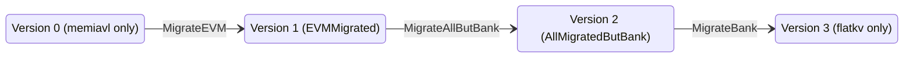
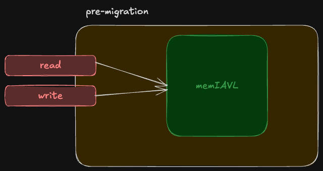
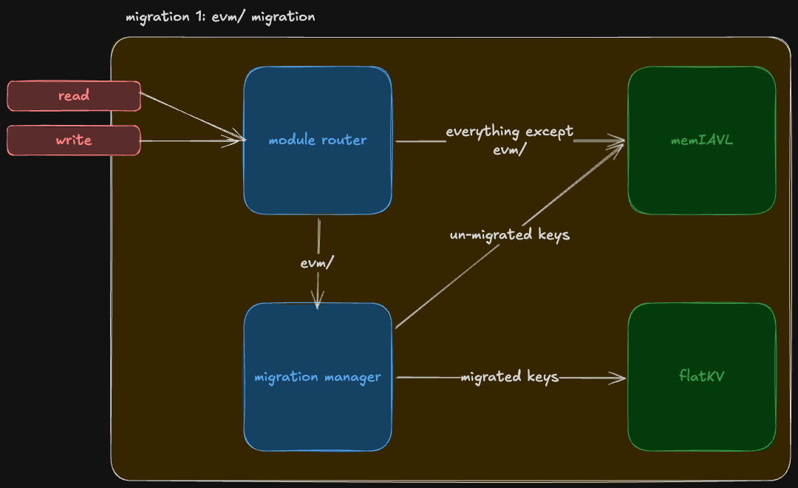
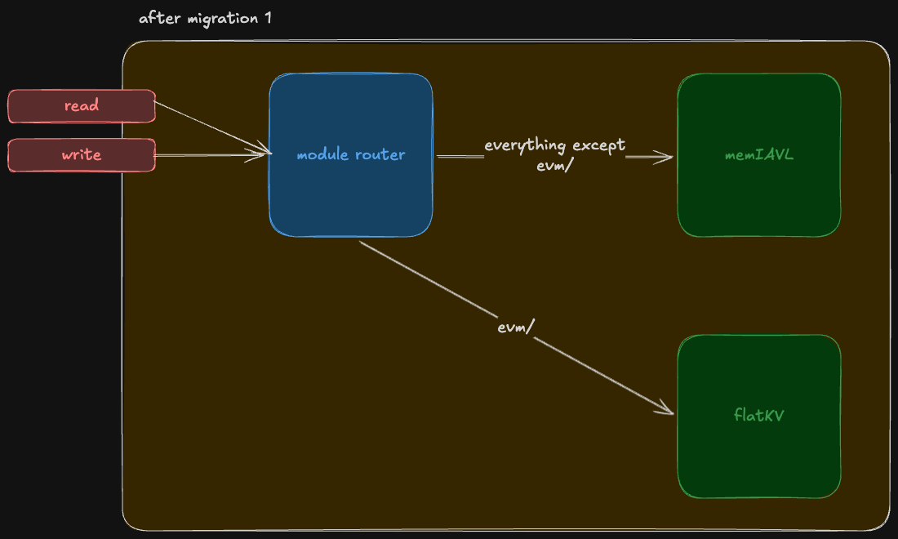
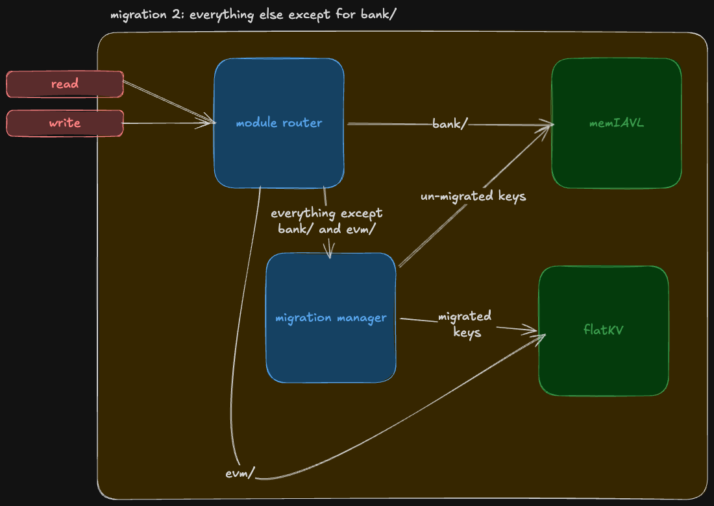
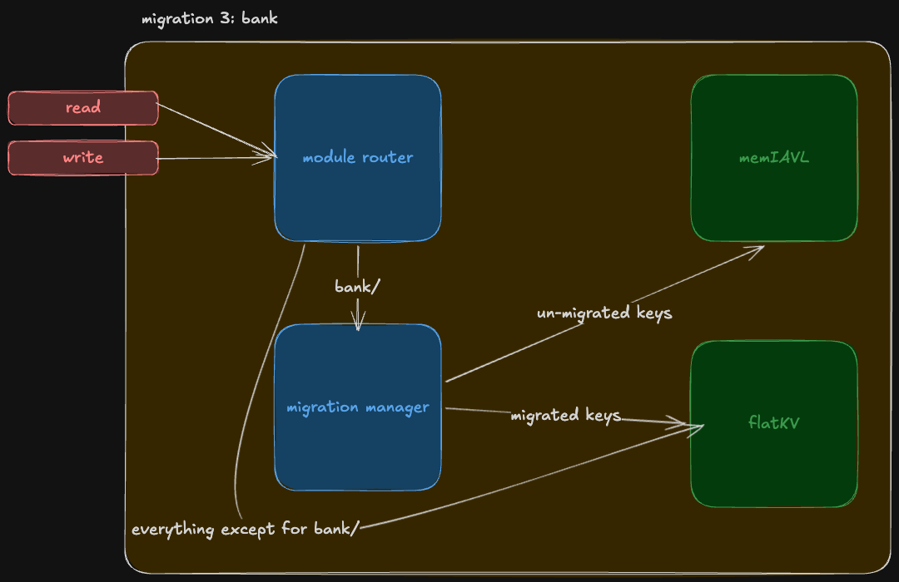
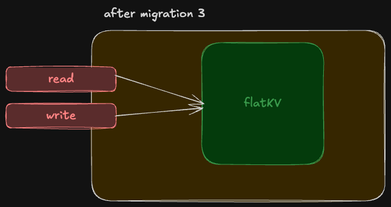

# Migration

This package owns the multi-phase migration of state from `memiavl` to `flatkv`. The migration is split into four versions (V0, V1, V2, V3) connected by three transitions, each of which moves a slice of the keyspace (`evm/`, then "everything except `bank/`", then `bank/`) from the old backend to the new one. While a migration is in progress, [`BuildRouter`](router_builder.go) produces a per-mode `ModuleRouter` that decides, on a per-store basis, whether reads and writes go through the [`MigrationManager`](migration_manager.go) or directly to a single backend; `BuildRouter` always wraps its result in [`NewThreadSafeRouter`](thread_safe_router.go) before returning. The two terminal states (V0 and V3) are reached by *not* calling `BuildRouter` at all: the bootstrap layer detects them and writes directly to the single backend that owns all state in that steady state.

## State machine

V0 and V3 are lowercase data-layout descriptors: they describe the shape of state on disk but have no associated `WriteMode` constant because no migration is in progress. V1 and V2 are steady states that share names with the `WriteMode` values that produce them (`EVMMigrated`, `AllMigratedButBank`).

## Phases

### Version 0: pre-migration (V0)

A node that has never migrated starts here. All reads and writes go directly to memiavl; the migration package is not in the data path. Bootstrap detects this state via `IsAtVersion` and skips [`BuildRouter`](router_builder.go) entirely, so neither the `MigrationManager` nor any `ModuleRouter` is constructed. See `Version0_MemiavlOnly` in [migration_versions.go](migration_versions.go).

### MigrateEVM (V0 -> V1)

The first transition. A `ModuleRouter` routes `evm/` keys through the [`MigrationManager`](migration_manager.go), which splits between un-migrated keys still living in memiavl and migrated keys already in flatkv; every other module routes directly to memiavl. Each block migrates `migrationBatchSize` keys forward; the boundary cursor is persisted in the migration metadata store so a restart resumes mid-stream. See `WriteMode = MigrateEVM` in [write_mode.go](write_mode.go), built by `buildMigrateEVMRouter` in [router_builder.go](router_builder.go).

### Version 1: EVMMigrated (V1)

Steady state after the EVM migration completes. The `ModuleRouter` sends `evm/` keys directly to flatkv and routes everything else to memiavl; the `MigrationManager` is no longer in the data path for this version. See `WriteMode = EVMMigrated` in [write_mode.go](write_mode.go), built by `buildEVMMigratedRouter` in [router_builder.go](router_builder.go). On disk this maps to `Version1_MigrateEVM` in [migration_versions.go](migration_versions.go).

### MigrateAllButBank (V1 -> V2)

The second transition. The `ModuleRouter` routes `bank/` directly to memiavl (untouched by this transition), `evm/` directly to flatkv (already migrated in V1), and every other module through the [`MigrationManager`](migration_manager.go) so its keys are walked across in batches. See `WriteMode = MigrateAllButBank` in [write_mode.go](write_mode.go), built by `buildMigrateAllButBankRouter` in [router_builder.go](router_builder.go).

### Version 2: AllMigratedButBank (V2)

Steady state after the second migration. The `ModuleRouter` routes `bank/` to memiavl and every other module directly to flatkv; the `MigrationManager` is again out of the data path. See `WriteMode = AllMigratedButBank` in [write_mode.go](write_mode.go), built by `buildAllMigratedButBankRouter` in [router_builder.go](router_builder.go). On disk this maps to `Version2_MigrateAllButBank` in [migration_versions.go](migration_versions.go).

### MigrateBank (V2 -> V3)

The final transition. The `ModuleRouter` routes `bank/` through the [`MigrationManager`](migration_manager.go) and sends every other module directly to flatkv. When the boundary cursor reaches the end and the version bumps, the node has fully landed in V3. See `WriteMode = MigrateBank` in [write_mode.go](write_mode.go), built by `buildMigrateBankRouter` in [router_builder.go](router_builder.go).

### Version 3: post-migration (V3)

Terminal state. All reads and writes go directly to flatkv; the migration package is not in the data path. Bootstrap detects "DB is at `Version3_FlatKVOnly`" via `IsAtVersion` and stops calling [`BuildRouter`](router_builder.go), so no router or manager is constructed for nodes that have completed all three migrations. See `Version3_FlatKVOnly` in [migration_versions.go](migration_versions.go).

## Migration manager and routers

The data path during an active migration is built from four pieces:

- [migration_manager.go](migration_manager.go) defines the `MigrationManager`, which owns the boundary cursor and applies a per-block batch of forward-migrated keys alongside the application's own writes.
- [module_router.go](module_router.go) defines `ModuleRouter` and the `Route` types that map a store name to either a single backend or the migration manager.
- [router_builder.go](router_builder.go) holds the per-mode builders (`buildMigrateEVMRouter`, `buildEVMMigratedRouter`, `buildMigrateAllButBankRouter`, `buildAllMigratedButBankRouter`, `buildMigrateBankRouter`); the per-mode ASCII data-flow diagrams in that file are the operational spec for "what writes where on each block."
- [thread_safe_router.go](thread_safe_router.go) wraps a built router so external `Read` calls and `ApplyChangeSets` are serialized.

The `MigrationManager` itself is *not* safe for concurrent use; callers must not share one across goroutines without external synchronization. [`BuildRouter`](router_builder.go) wraps every router it returns in [`NewThreadSafeRouter`](thread_safe_router.go), so callers that go through `BuildRouter` get a thread-safe handle for free.

## Migration metadata

`MigrationStore` is a reserved store name (defined in [migration_keys.go](migration_keys.go)) that the `MigrationManager` owns for its own bookkeeping; external writes to this store are rejected. `MigrationVersionKey` records the on-disk schema version as an 8-byte big-endian `uint64` and is the source of truth for "which migration, if any, is active." `MigrationBoundaryKey` records the in-progress migration cursor so a restart can resume forward-walking from where it stopped. Both keys are persisted in flatkv (the new database) so that the new database is self-describing once a migration has begun.
