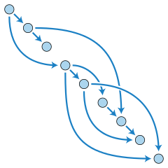

# Your basic graph [][godoc-graph]

### Golang library of basic graph algorithms

*Topological ordering, image by [David Eppstein][de], [CC0 1.0][cc010].*

This library offers efficient and well-tested algorithms for

- breadth-first and depth-first search,
- topological ordering,
- strongly and weakly connected components,
- bipartion,
- shortest paths,
- maximum flow,
- Euler walks,
- and minimum spanning trees.

The algorithms can be applied to any graph data structure implementing
the two `Iterator` methods: `Order`, which returns the number of vertices,
and `Visit`, which iterates over the neighbors of a vertex.

All algorithms operate on directed graphs with a fixed number
of vertices, labeled from 0 to n-1, and edges with integer cost.
An undirected edge {v, w} of cost c is represented by the two
directed edges (v, w) and (w, v), both of cost c.
A self-loop, an edge connecting a vertex to itself,
is both directed and undirected.

### Graph data structures

The type `Mutable` represents a directed graph with a fixed number
of vertices and weighted edges that can be added or removed.
The implementation uses hash maps to associate each vertex
in the graph with its adjacent vertices. This gives constant
time performance for all basic operations.

The type `Immutable` is a compact representation of an immutable graph.
The implementation uses lists to associate each vertex in the graph
with its adjacent vertices. This makes for fast and predictable
iteration: the Visit method produces its elements by reading
from a fixed sorted precomputed list.

### Virtual graphs

The subpackage `graph/build` offers a tool for building graphs of type `Virtual`.

In a virtual graph no vertices or edges are stored in memory,
they are instead computed as needed. New virtual graphs are constructed
by composing and filtering a set of standard graphs, or by writing
functions that describe the edges of a graph.

The following standard graphs are predefined:

- empty graphs,
- complete graphs and complete bipartite graphs,
- grid graphs and complete *k*-ary trees,
- cycle graphs and circulant graphs,
- and hypergraphs.

The following operations are supported:

- adding and deleting sets of edges,
- adding cost functions,
- filtering graphs by edge functions,
- complement, intersection and union,
- subgraphs,
- connecting graphs at a single vertex,
- joining two graphs by a set of edges,
- matching two graphs by a set of edges,
- cartesian product and tensor product.

Non-virtual graphs can be imported, and used as building blocks,
by the `Specific` function. Virtual graphs don't need to be “exported‬”;
they implement the `Iterator` interface and hence can be used directly
by any algorithm in the graph package.

### Installation

Once you have [installed Go][golang-install], run this command
to install the `graph` package:

    go get github.com/yourbasic/graph

    
### Documentation

There is an online reference for the package at
[godoc.org/github.com/yourbasic/graph][godoc-graph].

### Roadmap

* The API of this library is frozen.
* Bug fixes and performance enhancement can be expected.
* New functionality might be included.
* Version numbers adhere to [semantic versioning][sv].

The only accepted reason to modify the API of this package is to
handle issues that can't be resolved in any other reasonable way.

New features and performance enhancements are limited to basic
algorithms and data structures, akin to the ones that you might find
in a computer science textbook.

Stefan Nilsson – [korthaj](https://github.com/korthaj)

[godoc-graph]: https://godoc.org/github.com/yourbasic/graph
[golang-install]: http://golang.org/doc/install.html
[cc010]: https://creativecommons.org/publicdomain/zero/1.0/deed.en
[de]: https://commons.wikimedia.org/wiki/User:David_Eppstein
[sv]: http://semver.org/

